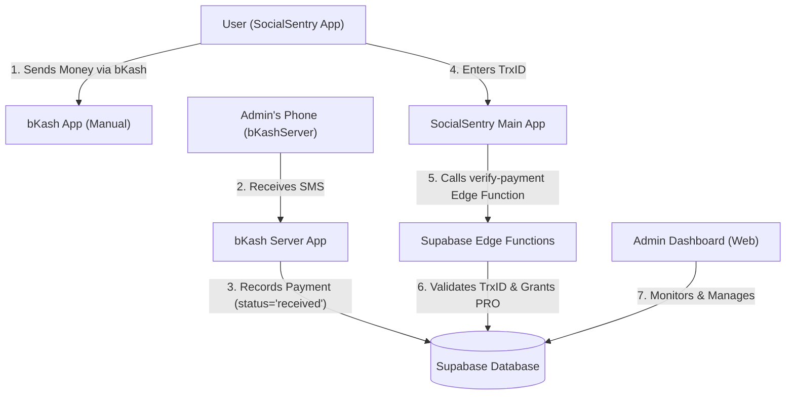

# 📱 SocialSentry — Complete App Documentation

> **Package**: `com.socialsentry.ai`  
> **Architecture**: MVVM + Jetpack Compose + Kotlin Coroutines + DataStore + Supabase + Room DB  
> **Last Updated**: April 1, 2026

---

## 📑 Table of Contents

1. [App Overview](#app-overview)
2. [Architecture & System Overview](#architecture--system-overview)
3. [Permissions Required](#permissions-required)
4. [Navigation & Pages](#navigation--pages)
   - [Home Screen](#1-home-screen)
   - [Blocks Screen](#2-blocks-screen)
   - [Profile Screen](#3-profile-screen)
   - [Usage Screen](#4-usage-screen)
   - [Todo Screen](#5-todo-screen)
   - [Community Screen](#6-community-screen)
   - [Menu & Subscription Screen](#7-menu--subscription-screen)
5. [Feature Deep-Dives](#feature-deep-dives)
   - [Master Blocking (Reels Block)](#master-blocking--reels-block)
     - [Progressive Reels Lockout (Cooldown)](#progressive-reels-lockout-cooldown)
   - [Force Mode (Focus Mode)](#force-mode--focus-mode)
   - [Scroll Limiter](#scroll-limiter)
   - [Safety Mode](#safety-mode)
   - [Adult Blocker](#adult-blocker)
   - [NSFW AI Shield](#nsfw-ai-shield)
   - [App Usage Limits](#app-usage-limits)
   - [Website Blocker](#website-blocker)
   - [Block Uninstall](#block-uninstall)
   - [Prime Mode](#prime-mode)
   - [MyBrain Dashboard](#mybrain-dashboard)
   - [MyBook Dashboard](#mybook-dashboard)
   - [Subscription & Paywalls](#subscription--paywalls)
   - [Ranking System](#ranking-system)
   - [Hakari AI Assistant (Waifu)](#hakari-ai-assistant-waifu)
   - [Fahh Mode](#fahh-mode)
   - [Todo / Task Manager](#todo--task-manager)
   - [Community Portal](#community-portal)
   - [Notifications System](#notifications-system)
   - [Solo Leveling Notification System](#solo-leveling-notification-system)
   - [Auto Force Mode Schedules](#auto-force-mode-schedules)
6. [Settings Pages](#settings-pages)
   - [Adult Blocker Settings](#adult-blocker-settings)
   - [Scroll Limiter Settings](#scroll-limiter-settings)
   - [Safety Mode Settings](#safety-mode-settings)
   - [Force Mode App Selection](#force-mode-app-selection)
   - [Force Mode Auto Setup (Auto-Focus)](#force-mode-auto-setup-auto-focus)
   - [Hakari AI Notification Page](#hakari-ai-notification-page)
   - [Privacy Policy](#privacy-policy)
   - [Developer Options](#developer-options)
   - [SocialSentry Pro Paywall](#socialsentry-pro-paywall)
7. [Accessibility Service Engine](#accessibility-service-engine)
8. [Background Services](#background-services)
9. [Android Widgets](#android-widgets)
10. [Onboarding Flow (V2)](#onboarding-flow-v2)
11. [Human Verification](#human-verification)
12. [Overlay Activities](#overlay-activities)
13. [Data Layer](#data-layer)
14. [IPC & External Control](#ipc--external-control)
15. [Analytics & Logging](#analytics--logging)
16. [Future / Planned Features](#future--planned-features)

---

## App Overview

**SocialSentry** is a comprehensive digital wellbeing and self-control Android application specifically designed to help users—especially students, teens, and individuals struggling with digital distractions—overcome social media addiction and reclaim their real-life focus.

At its core, SocialSentry is more than just an app blocker; it is an intelligent digital sentry that actively monitors, intercepts, and prevents destructive digital habits, such as doomscrolling through short-form video content (Reels, Shorts, TikTok feeds) or accessing adult content.

### What SocialSentry Does:
SocialSentry utilizes Android's powerful Accessibility Services, background monitors, and on-device Machine Learning to achieve its goals. By design, the app has **over 15+ built-in major features** focused on discipline:
1. **Intercept and Block Short-Form Content**: Automatically detects and blocks the Reels/Shorts feeds within major social media apps (Instagram, YouTube, Facebook, TikTok), seamlessly redirecting the user away from endless scrolling traps.
2. **Enforce Screen Time & Scroll Limits**: Strictly limits how long a user can continuously scroll before enforcing a mandatory break, alongside hard daily app usage limits.
3. **Protect Against Adult Content**: Features a multi-layered adult content blocker (Browser Keyword Scans, DNS Protection, On-device NSFW ML Shield) to keep users safe from explicit content.
4. **Boost Productivity with Focus States**: Offers 'Force Mode' and 'Prime Mode' for deep work, locking the device down to only essential apps and strictly preventing circumvention.
5. **Provide AI Companionship & Analytics**: Features a dual-LLM AI assistant, **Hakari**, who provides motivation, coupled with high-level 'MyBrain' and 'MyBook' analytical dashboards. **Now with persistent Room DB conversation history.**
6. **Gamify Discipline**: A robust ranking and streak system that rewards users with badges (from CLOWN to GIGA CHAD) for maintaining their blockers and avoiding relapses.
7. **Foster a Dedicated Community**: An interactive in-app community portal and global feed where users publicly commit to their goals, forming accountability through upvotes and comments.
8. **Progressive Short-Form Interception**: A tiered "Hard Lockout" system (20s -> 30s -> Force Close) that enforces stricter boundaries for consecutive Reels access attempts.
9. **Smart To-Do Manager**: Beyond simple lists, includes **Recurring Routines** that auto-copy daily to help build long-term habits.


---

## Business & Market Context

> **Designed for a Senior Developer onboarding to the project**: SocialSentry is currently live on the Google Play Store and has significant traction. Any changes made to this codebase directly impact an active, engaged community. 

**Current Live Metrics (March 2026):**
- **Total Downloads / Installs**: 30k  
- **Daily Active Users (DAU)**: ~2.5k 
- **Monthly Active Users (MAU)**: ~16k  (estimated)
- **Play Store Rating**: 4.65 ⭐ (from 1,100+ user reviews)
paid user used got the subsction the subsction luch ont he mcr 24 10 pm not its march 25 4pm adn totla 40 epole subscrinbe thsi app using the cupon 33 user and other adfre the pay for the full cupon use pay for 1 month 15tk and the other pay 1 pmonth 149 tk nothe roen pay for 3 mnth 349 tk  

*Developer Note*: Because this app operates heavily via an Android Accessibility Service and Device Admin, rigorous testing is required before deploying updates to the Play Store. A small bug in the Accessibility Service can disrupt the UX for 2,000 daily users instantly.

---

## Codebase Directory Navigation

To help you get started quickly, here is the high-level layout of `app/src/main/java/com/socialsentry/ai/`:

| Directory | Purpose | What you will find here |
|---|---|---|
| `/accessibility/` | **The Core Engine**. Everything related to reading the screen and drawing overlays. | `SocialSentryAccessibilityService.kt`, `ReelsShortsBlocker.kt`, `AdultContentManager.kt`, `ScrollLimiterManager.kt` |
| `/blocking/` | **Block Logic & Rules**. Modular logic for *when* to block things. | `ForceModeBlocker.kt`, `/schedule/` (Schedule Blocker logic), `/data/` (Keyword lists) |
| `/data/` | **Repositories & Local DB**. Supabase clients, Room DB, Network calls. | `AuthRepository.kt`, `/local/` (ForceModeDatabase), API services. |
| `/datastore/` | **Persistent User Settings**. Proto DataStore logic. | `DataStoreManager.kt`, `AppSettings.kt` (The global state data class) |
| `/domain/` | **Business Logic**. Pure logic managers that tie multiple systems together. | `HakariCheckInManager.kt`, `UnblockAllowanceManager.kt`, `NotificationManager` |
| `/service/` | **Background Android Services**. Things running continuously in the background. | `ForegroundAppMonitorService.kt` (UsageStats), `CommandService.kt` (IPC) |
| `/ui/` | **Jetpack Compose Screens**. All UI code. | `/home/`, `/block/` (Blocks Screen), `/settings/` (all individual settings pages), `/overlay/` |
| `/waifu/` | **Hakari AI**. Everything related to the AI assistant. | `WaifuEngine.kt`, Gemini setup, AI UI. |
| `/widget/` | **Home Screen Widgets**. | Glance definitions, regular App Widgets. |

---

## Engineering & Tech Stack Overview

This app is built using modern native Android declarative architecture (2025/2026 standards). Any new developer should familiarise themselves with these libraries as they form the backbone of the app.

### Core Technologies:
| Category | Technology / Library |
|---|---|
| **UI Framework** | Jetpack Compose (Material 3), Lottie (Animations), Coil (Image/GIF loading) |
| **Architecture** | MVVM (Model-View-ViewModel) + Kotlin Coroutines & Flow |
| **Dependency Injection** | **Koin** (`koin-androidx-compose`) |
| **Local Persistence** | Proto **DataStore** (for `AppSettings` / global state) + **Room Database** (for `ForceModeSession` history) |
| **Backend / DB API** | **Supabase** (Postgrest, GoTrue Auth, Realtime, Storage, Functions) |
| **Networking** | Ktor Client (OkHttp engine) |
| **AI / ML Integration** | **Groq API (Llama 3)** (primary LLM via Ktor), **Google Gemini SDK** (`generativeai`) (fallback LLM), **ML Kit** (Pose Detection CameraX, Custom Image Labeling for NSFW) |
| **Widgets** | Jetpack **Glance** (Modern compose-style Android AppWidgets) |
| **Analytics & Crash** | Firebase (Analytics, Crashlytics, Cloud Messaging, In-App Messaging) |

### Build Specifications (from `build.gradle.kts`)
- **SDK Targets**: `compileSdk = 36`, `targetSdk = 36`, `minSdk = 24`
- **Kotlin Version**: Uses Kotlin JVM target 11 with the modern 2.0.21 serialization plugin.

**Build Variants**:
The project utilizes specific build types to drastically speed up local developer workflows regarding the massive codebase:
1. `debug`: Standard fast local build (No R8/minify).
2. `release`: Production build, fully optimized and shrunk using R8 (`proguard-rules.pro`). Slow build time. Requires `keystore.properties` in root.
3. `staging`: Quick staging build based on debug but deployed as a separate app (`applicationIdSuffix = ".staging"`). Perfect for internal QA without overwriting production installs.
4. `releaseLocal`: Custom debug build disguised as a release environment for specific endpoint testing.

### Environment Setup (`.env` handling)
The `build.gradle.kts` parses a local `.env` file at the root to securely inject API keys into the `BuildConfig`. New developers MUST create this `.env` file locally before building:
```properties
SUPABASE_URL="yoursupabaseurl"
SUPABASE_ANON_KEY="yoursupabasekey"
GEMINI_API_KEY="yourkey"
GEMINI_API_KEY_1="backup_key_1"
GEMINI_API_KEY_2="backup_key_2"
GEMINI_API_KEY_3="backup_key_3"
GEMINI_API_KEY_4="backup_key_4"
```
*(Note: Gemini keys are rotated automatically by `GeminiKeyManager` in the code to handle strict rate-limits.)*

---

## 🛠 Development & Building

### Prerequisites (MacOS)
To build the application successfully from the terminal, you must have a Java Runtime (JDK) installed. If you have Android Studio installed, you can use its bundled JDK.

### 📦 Building the Debug APK
Run the following command from the root directory to generate a debug APK:

```bash
# Set JAVA_HOME to Android Studio's bundled JDK and build
export JAVA_HOME="/Applications/Android Studio.app/Contents/jbr/Contents/Home" && ./gradlew :app:assembleDebug
```

The generated APK will be located at:
`app/build/outputs/apk/debug/app-debug.apk`

### 🧹 Cleaning the Build
If you encounter resource errors or stale asset issues, run:
```bash
./gradlew clean
```

---

## Architecture & System Pipeline

```
SocialSentryApplication (Koin DI Setup)
   └── MainActivity (Single Activity + Compose Navigation)
         ├── SocialSentryViewModel (central state: DataStore → StateFlow → UI)
         ├── DataStoreManager (Proto DataStore - AppSettings persistence)
         ├── AuthRepository (Supabase Auth — login, profile, sync)
         ├── NotificationRepository (Supabase Realtime — remote notifications)
         ├── SoloLevelingScreen (Solo Leveling Teaser & Interactive Hub)
         └── WaifuEngine (Hakari AI: Groq Primary / Gemini Fallback via SocialSentryAIService)

SocialSentryAccessibilityService (A11y Engine — always-on background processor)
   ├── SoloLevelingNotificationScreen (3-Phase Animated Neon Notification)
   ├── ReelsShortsBlocker   (`accessibility/ReelsShortsBlocker.kt` — blocks Reels/Shorts/TikTok feeds)
   ├── ScrollLimiterManager (`accessibility/ScrollLimiterManager.kt` — tracks scroll time per app, enforces breaks)
   ├── AdultContentManager  (`accessibility/AdultContentManager.kt` — blocks adult content in browsers)
   └── NsfwShieldManager    (`accessibility/NsfwShieldManager.kt` — on-device ML NSFW overlay)

ForceModeBlocker            (`blocking/blockers/ForceModeBlocker.kt` — kicks user out of blocked apps during focus sessions)
HakariCheckInManager        (`domain/HakariCheckInManager.kt` — fires hourly Hakari reminder notifications)
ForegroundAppMonitorService (`service/ForegroundAppMonitorService.kt` — UsageStats API, tracks which app is open)
BrainApiService             (`service/BrainApiService.kt` — connects to remote API for advanced data)
CommandService              (`service/CommandService.kt` — IPC AIDL — allows MyBrain companion app to control Sentry)
SocialSentryMessagingService (`service/SocialSentryMessagingService.kt` — Firebase Cloud Messaging — remote push notifications)
```

---

## Permissions Required

| Permission | Why It's Needed |
|---|---|
| `ACCESSIBILITY_SERVICE` | Core engine to detect & block Reels/Shorts; scroll limiter; safety countdown; force mode |
| `PACKAGE_USAGE_STATS` | Track app usage times for , Scroll Limiter, App Limits, and Usage Screen |
| `SYSTEM_ALERT_WINDOW` | Show overlays (Safety countdown, Scroll break, NSFW shield) above other apps |
| `FOREGROUND_SERVICE` | Keep ForegroundAppMonitorService alive in background |
| `REQUEST_IGNORE_BATTERY_OPTIMIZATIONS` | Prevent Android from killing the service |
| `POST_NOTIFICATIONS` | Send Hakari hourly reminders and blocking notifications |
| `CAMERA` | NSFW Shield — posture detector / pose analysis |
| `ACTIVITY_RECOGNITION` | Walking detection (WalkingCounterActivity) |
| `KILL_BACKGROUND_PROCESSES` | Kill blocked app processes |
| `BIND_DEVICE_ADMIN` | Device Admin — Required for **Prime Mode** and Uninstall Prevention. Cannot remove app without deactivating admin |
| `INTERNET` | Supabase sync, Gemini AI, Firebase Cloud Messaging |
| `QUERY_ALL_PACKAGES` | Read all installed apps for app picker / usage stats |

---

## Navigation & Pages

Navigation is handled inside `MainActivity.kt` and `SocialSentryScreen.kt` via a custom `_currentRoute` StateFlow in `SocialSentryViewModel`.

### Bottom Navigation Bar

The bottom nav is a **floating glass pill** UI defined in `HomeComponents.kt → SocialSentryBottomBar`. It auto-hides after 5 seconds of inactivity and reappears on scroll-up or screen tap.

**Left Pill** (3 tabs):
| Tab | Route | Free | PRO |
|---|---|---|---|
| ✅ To Do | `todo` | ✅ Yes | ✅ Yes |
| 🏠 Home | `home` | ✅ Yes | ✅ Yes |
| 👥 Community | `community` | ✅ Yes (requires Google auth) | ✅ Yes |

**Right Pill** (1 tab):
| Tab | Route | Free | PRO |
|---|---|---|---|
| 🛡️ Block | `block` | ✅ Yes (some features PRO-gated) | ✅ Full access |

### All App Routes (Complete Map)

| Route | Screen | Auth Required | Human Verified | Free | PRO |
|---|---|---|---|---|---|
| `home` | Home Screen | No | No | ✅ | ✅ |
| `todo` | Todo Screen | No | No | ✅ | ✅ |
| `block` | Block Screen | No | No | ✅ (partial) | ✅ Full |
| `community` | Community Screen | Yes (Google) | No | ✅ | ✅ |
| `community_report` | Community → Report Tab | Yes (Google) | No | ✅ | ✅ |
| `profile` | Profile Screen | Yes | Yes (OTP) | ✅ | ✅ |
| `code_profile` | Code Profile | Yes | No | ✅ | ✅ |
| `ranking` | Ranking Screen | Yes | No | ✅ | ✅ |
| `usage` | Usage Screen | No | No | ✅ | ✅ |
| `subscription` | Subscription Page | No | No | ✅ | ✅ |
| `force_mode` | Force Mode Screen | No | No | ✅ (manual) | ✅ + Auto schedules |
| `force_mode_app_selection` | App Selection | No | No | ✅ | ✅ |
| `force_mode_auto_setup` | Auto-Focus Setup | No | No | ❌ Paywalled | ✅ |
| `schedule_blocker` | Schedule Blocker | No | No | ❌ Paywalled | ✅ |
| `solo_leveling` | Solo Leveling Hub | No | No | ✅ | ✅ |
| `human_verification` | Phone OTP Screen | Yes | N/A | ✅ | ✅ |
| `auth_required` | Login Screen | No | No | ✅ | ✅ |
| `tutorial` | Tutorial Screen | No | No | ✅ | ✅ |
| `whats_new` | What's New | No | No | ✅ | ✅ |
| `developer_options` | Developer Options | No | No | Hidden (tap 7x) | Hidden |
| `custom_sentence` | Safety Overlay Editor | No | No | ✅ | ✅ |
| `reels_blocker` | Reels Blocker Config | No | No | ✅ (partial) | ✅ Full |
| `contribution` | Contribution Screen | No | No | ✅ | ✅ |

**Auth-gated routes**: `profile`, `code_profile`, `ranking`, `usage` all require:
1. Supabase authentication (Google Sign-In)
2. Human verification (phone number OTP)

If not authenticated → redirected to `auth_required`.  
If authenticated but not verified → redirected to `human_verification`.

---

## 1. Home Screen

**File**: `ui/components/SocialSentryScreen.kt`, `ui/home/HomeComponents.kt`, `ui/home/MyBrainScreen.kt`, `ui/home/MyBookScreen.kt`

The Home Screen is the central control hub. Navigation bar: **ToDo | Home | Community** (left pill) + **Block** (right pill).

### Top App Bar
| Element | Description | Free | PRO |
|---|---|---|---|
| ☰ Menu Icon | Opens `MenuPage` overlay | ✅ | ✅ |
| 🔥 Strike Badge | Animated Lottie flame + streak days; taps navigate to `subscription` | ✅ | ✅ |
| 👤 Profile Icon | Navigates to `code_profile` | ✅ | ✅ |

### Usage Stats Card
| Sub-Feature | Description | Free | PRO |
|---|---|---|---|
| Today's Screen Time | Total screen time from `UsageStatsHelper` | ✅ | ✅ |
| Distracting Time | Social media usage only | ✅ | ✅ |
| Tap → Usage Screen | Opens `usage` route | ✅ | ✅ |

### Permission Request Cards (Priority Ordered — shown 1 at a time)
| Priority | Permission | When Shown |
|---|---|---|
| 1 | Accessibility Service | When `isAccessibilityGranted = false` |
| 2 | Background (Battery Optimization) | When `isBatteryOptimizationGranted = false` |
| 3 | Notifications | Android 13+, when `isNotificationGranted = false` |
| 4 | Usage Stats | When `isUsageStatsGranted = false` |

### Feature Cards Grid
| Feature Card | Route / Dialog | Free | PRO |
|---|---|---|---|
| 🔴 Master Block Toggle | Turn on/off all blocking (with temp-unblock timer) | ✅ | ✅ |
| ⚡ Force Mode | → `force_mode` screen | ✅ (manual) | ✅ + Auto schedules |
| 🧠 MyBrain Dashboard | → `MyBrainScreen` overlay | ❌ Paywalled | ✅ |
| 📖 MyBook Dashboard | → `MyBookScreen` overlay | ✅ | ✅ |
| 🛡️ Safety Mode | → `SafetyModeScreen` overlay | ✅ | ✅ |
| 📵 Scroll Limiter | → `ScrollLimiterScreen` overlay | ❌ Paywalled | ✅ |
| 🔞 Adult Blocker | → `AdultBlockerOnboarding` → `AdultBlockerScreen` | ✅ | ✅ |
| 🤖 Hakari AI | AI chat / notification page | ✅ | ✅ |
| ⭐ Solo Leveling | → `solo_leveling` route | ✅ | ✅ |

### Master Block Toggle Behaviour
| Scenario | Behaviour |
|---|---|
| Turn **ON** | Enables all blocking; checks battery optimization permission first |
| Turn **OFF** | Opens duration picker (10 min default); sets `isTemporaryUnblockActive = true` |
| **Prime Mode** active + no time left | Shows "Insufficient Time" dialog; block stays ON |
| Adult Blocker | **Always stays ON** regardless of Master Block state |
| Auto-reblock | Timer persisted in DataStore; fires even after app kill |

### Top-Bar Overlay Screens (launched from Home)
| Screen | Access |
|---|---|
| MyBrain Dashboard | PRO only — opens `showMyBrain` overlay |
| Usage Screen | Free — opens via `showUsageScreen` overlay |
| Safety Mode Settings | Free — opens `showSafetySettings` overlay |
| Scroll Limiter Settings | PRO — opens `showScrollLimiterSettings` overlay |
| Adult Blocker Onboarding | Free — opens `showAdultBlockerOnboarding` overlay |
| Adult Blocker Screen | Free — opens `showAdultBlockerScreen` overlay |
| Reels Blocker Screen | Free/PRO — opens `showReelsBlocker` overlay |
| App Limit Screen | Free — opens `showAppLimitScreen` overlay |

### Header & Ranking Area
| Element | Description | Free | PRO |
|---|---|---|---|
| 🔥 Strike indicator | Animated flame Lottie + streak count (`currentStrikeDays`) | ✅ | ✅ |
| 🏆 Ranking badge | CLOWN → GIGA CHAD tier badge; driven by `rankingBadge` | ✅ | ✅ |
| Ranking starts | When Adult Blocker first enabled | ✅ | ✅ |
| Ranking resets | If Adult Blocker is disabled (relapse) | ✅ | ✅ |

### Hakari AI Widget
| Element | Description | Free | PRO |
|---|---|---|---|
| AI Message display | Groq (Llama 3) → Gemini fallback, via `WaifuEngine` | ✅ | ✅ |
| Interactive avatar | Tap navigates to Hakari notification/chat page | ✅ | ✅ |

---

## 2. Blocks Screen

**File**: `ui/block/BlockScreen.kt`

The Block tab is accessible via the right pill of the bottom nav. It groups all blocking features into 4 collapsible sections.

### Section 1: Block Shorts (Reels Blocking)
Expandable accordion per platform. Each row shows a toggle and a progress indicator.

| Platform | App Variant | Setting Key | Free | PRO |
|---|---|---|---|---|
| **YouTube** | YouTube Shorts (native) | `youtube.blocked` | ✅ | ✅ |
| **YouTube** | YouTube Shorts via Chrome | `chromeReelsBlockerEnabled` | ❌ | ✅ |
| **Instagram** | Instagram Reels (native) | `instagram.blocked` | ✅ | ✅ |
| **Instagram** | Instagram Lite | `instagramLite.blocked` | ❌ | ✅ |
| **Facebook** | Facebook Reels (native) | `facebook.blocked` | ✅ | ✅ |
| **Facebook** | Facebook Lite | `facebookLite.blocked` | ❌ | ✅ |
| **Facebook** | Facebook Reels via Chrome | `chromeReelsBlockerEnabled` | ❌ | ✅ |
| **TikTok** | TikTok full app | `tiktok.blocked` | ❌ | ✅ |

> All Chrome-based blockers share a single `chromeReelsBlockerEnabled` setting.

### Section 2: App Limits

| Feature | Description | Free | PRO |
|---|---|---|---|
| App Limit Cards | Shows per-app usage limit progress bars (FB, IG, TikTok, custom apps) | ✅ | ✅ |
| Add App Limit | App picker + daily time cap | ✅ | ✅ |
| Strict Mode | Enforce hard block when limit hit | ✅ | ✅ |
| Emergency Use | Temporary bypass for limits | ✅ | ✅ |
| Usage Stats Guard | Requests `PACKAGE_USAGE_STATS` permission if missing | ✅ | ✅ |
| Navigate → App Limits Screen | Full settings screen | ✅ | ✅ |

### Section 3: Schedule Blocker

| Feature | Description | Free | PRO |
|---|---|---|---|
| Schedule Blocker | Time-based block profiles with custom names | ❌ (paywall shown) | ✅ |
| Navigate → `schedule_blocker` route | `ScheduleBlockerScreen.kt` | ❌ | ✅ |

### Section 4: Other Blocks

| Feature | Setting Key | Description | Free | PRO |
|---|---|---|---|---|
| Block Websites | `browserProtectionEnabled` | DNS + keyword blocking of adult/explicit sites | ❌ | ✅ |
| Block Uninstall | `uninstallPreventionEnabled` | Device Admin — prevents app removal | ❌ | ✅ |
| Block Notifications | — | Placeholder — Coming Soon | — | — |

---

## 3. Account & Settings / Profile Screens

**File**: `ui/profile/CodeProfileScreen.kt`, `ui/profile/ProfileScreen.kt`, `ui/ranking/RankingScreen.kt`

**Auth Required** (Google Sign-In) + **Human Verification Required** (phone OTP)

### Sub-Features

| Sub-Feature | Description | Free | PRO |
|---|---|---|---|
| User Identity Card | Avatar (Google or Rank), Display Name, and Handle (or "Guest") | ✅ | ✅ |
| Current Rank Label | Displays Rank title, karma/XP progress, and Prime Mode Star | ✅ | ✅ |
| Prime Mode Card | Toggle, Prime Mode status indicator, and Remaining Allowance Time | ❌ | ✅ |
| Profile Insights | Activity Heatmap, Stats Radar, and Weekly Activity Chart (`ProfileScreen.kt`) | ✅ | ✅ |
| Ranking Details | Live Rank Badge (CLOWN → GIGA CHAD), streak timer, and detailed Relapse History (`RankingScreen.kt`) | ✅ | ✅ |
| Quick Access | Shortcuts to Community, Ranking, Report a Bug, and What's New | ✅ | ✅ |

---

## 4. Usage Screen

**File**: `ui/usage/UsageScreen.kt`, `ui/usage/UsageScreenSkeleton.kt`

**No auth required** — accessible from any user but requires `PACKAGE_USAGE_STATS` permission.

### Sub-Features

| Sub-Feature | Description | Free | PRO |
|---|---|---|---|
| Total Screen Time | Today's total phone usage via `UsageStatsManager` | ✅ | ✅ |
| Distracting App Time | Usage stats filtered to social media apps. **Context-Aware**: For IG/YT/FB, only counts if Reels Blocker is OFF. TikTok always counts. | ✅ | ✅ |
| Per-App Usage Breakdown | Sorted list of apps with icon, name, time used today | ✅ | ✅ |
| Admin Usage Override | Manually override stats values (admin mode only) | Admin | Admin |

---

## 5. Todo / Task Manager

**File**: `ui/todo/TodoScreen.kt`

**No auth required.** Accessible via the leftmost tab of the bottom nav (✅ icon).

### Sub-Features

| Sub-Feature | Description | Free | PRO |
|---|---|---|---|
| Task & Routine List | Create, view, complete one-off tasks or daily routines | ✅ | ✅ |
| Recurring Routines | Tasks marked as 'Routine' automatically persist/copy to the next day | ✅ | ✅ |
| Priority Categories | Color-coded custom priority categories per task | ✅ | ✅ |
| Subtasks | Create granular subtasks within a parent task | ✅ | ✅ |
| 7-Day Calendar Strip | Swipeable weekly calendar for task filtering and date selection | ✅ | ✅ |
| Profile Link | Links to `code_profile` from header | ✅ | ✅ |

---

## 6. Community Screen

**File**: `ui/community/CommunityScreen.kt`

**Auth Required** (Google Sign-In). Accessible via bottom nav 👥 tab.

### Sections

| Section | Description | Free | PRO |
|---|---|---|---|
| Global Feed | Public posts / commitments from all users | ✅ | ✅ |
| Expandable Descriptions | "See More" / "See Less" toggle for reading long commitments | ✅ | ✅ |
| Upvote & Comment | Interact with community posts via likes and hierarchical comments | ✅ | ✅ |
| Report Problem | Bug report form (also accessible via `community_report` route) | ✅ | ✅ |

---

## 7. Menu & Subscription Screen

**File**: `ui/menu/MenuPage.kt`

`MenuPage` is a full-screen overlay launched from the Home screen's hamburger menu icon. It provides navigation to several key areas.

### Menu Items

| Item | Destination | Free | PRO |
|---|---|---|---|
| Community Portal | `community` route | ✅ | ✅ |
| Report Bug | `community_report` route | ✅ | ✅ |
| View Profile | `profile` route | ✅ | ✅ |
| Contribution | `contribution` route | ✅ | ✅ |

### Subscription Screen (`ui/subscription/SubscriptionPage.kt`)

| Sub-Feature | Description | Free | PRO |
|---|---|---|---|
| Plan Cards | Dynamic pricing from `subscription_plans` Supabase table | ✅ | ✅ |
| Coupon Code | Instant validation + price adjustment | ✅ | ✅ |
| bKash Instructions | Dynamic payment instructions from `app_config` table | ✅ | ✅ |
| TrxID Input | User enters transaction ID | ✅ | ✅ |
| Payment Verification | Edge Function `verify-payment` validates TrxID + activates PRO | ✅ | ✅ |
| Success Lottie | Animated success screen on payment confirm | ✅ | ✅ |


---

## Feature Deep-Dives

### Feature Access Summary (Free vs PRO)

| Feature | Free | PRO |
|---|---|---|
| Reels Block — Instagram, YouTube, Facebook (native) | ✅ | ✅ |
| Reels Block — Chrome, TikTok, Lite apps | ❌ | ✅ |
| Master Block Toggle | ✅ | ✅ |
| Safety Mode (countdown overlay) | ✅ | ✅ |
| Safety Mode Overlay Customization | ✅ | ✅ |
| Adult Blocker (DNS + keyword) | ✅ | ✅ |
| Block Websites (Website Blocker) | ❌ | ✅ |
| App Usage Limits | ✅ | ✅ |
| Force Mode — Manual | ✅ | ✅ |
| Force Mode — Auto-Focus Schedules | ❌ | ✅ |
| Schedule Blocker | ❌ | ✅ |
| Scroll Limiter | ❌ | ✅ |
| NSFW AI Shield | ❌ | ✅ |
| Prime Mode | ❌ | ✅ |
| MyBrain Dashboard | ❌ | ✅ |
| MyBook Dashboard | ✅ | ✅ |
| Ranking System | ✅ | ✅ |
| Community Portal | ✅ (auth) | ✅ |
| Todo / Task Manager | ✅ | ✅ |
| Block Uninstall (Device Admin) | ❌ | ✅ |
| Hakari AI Assistant | ✅ | ✅ |
| Solo Leveling Hub | ✅ | ✅ |
| Solo Leveling Notifications | ❌ | ✅ |

---

### Force Mode (Manual & Auto-Focus)

**Settings keys**: `focusModeEnabled`, `focusModeType`, `autoForceModeSchedules`

**How it works**:
Force Mode represents an intensive deep-work state.
- **Manual Mode**: Allows starting an immediate timer. The app now strictly uses **Whitelist (Mode 1)** behavior, blocking all apps *except* the ones explicitly allowed.
- **Auto-Focus (`ForceModeAutoSetupScreen`) [PRO ONLY]**: Allows scheduling recurring focus blocks. Under the hood, the accessibility engine `ForceModeBlocker` monitors the active schedules list. All scheduled sessions use the Whitelist blocking strategy for maximum productivity. Accessing the setup requires a **PRO** subscription.

---

### Master Blocking / Reels Block (Free)

**Settings key**: `masterBlocking: Boolean`
**Tier**: **Free feature** (Basic apps) / **PRO feature** (Chrome, FB/IG Lite apps)

**How it works**:
1. User taps the main toggle on Home Screen.
2. If turning ON:
   - Checks if background battery optimization is ignored.
   - If not, shows permission dialog.
   - Calls `dataStoreManager.enableAllBlocking()` which sets `masterBlocking = true` and restores the `savedBlockingSnapshot`.
3. If turning OFF:
   - **Prime Mode Guard** (PRO): checks `remainingTemporaryUnblockMs` — if <= 0 and Prime Mode is active, shows insufficient time dialog and returns false (blocking stays ON).
   - User picks temporary unblock duration (default 10 min).
   - Calls `dataStoreManager.disableAllBlockingAndScheduleReblock(targetTime)` — atomically saves snapshot of current states and schedules reblock.
   - Starts a coroutine timer (`reblockJob`) that auto-re-enables after the duration.
   - Auto-reblock time is also persisted to DataStore (`autoReblockTime`) so it survives app kills.
   - **Adult Blocker Independence**: When the master blocker is turned OFF, the **Adult Blocker (porn blocker) specifically remains ON**. It can only be turned off manually, ensuring uninterrupted protection.
4. The Accessibility Service's `autoReblockJob` monitors the `autoReblockTime` field every 5 seconds as a safety net.

**Blocking Scope**: When master blocking is ON, these systems activate:
- Reels/Shorts blocking (per-app if toggled)
- Scroll Limiter (per-app if configured) - PRO integration
- Safety Mode countdown (if enabled)
- Chrome Reels Blocker (if enabled + PRO)

---

### Progressive Reels Lockout (Cooldown)

**Logic Location**: `SocialSentryAccessibilityService.kt`
**Status**: **Free & PRO**

**Concept**: A tiered penalty system specifically for "doomscrolling addicts" who repeatedly attempt to access blocked Reels/Shorts within a 30-second window.

#### How the Tiers Work:
1. **1st & 2nd Attempt**: Standard blocking (silent or with 5-second countdown overlay).
2. **3rd Consecutive Attempt**: Triggers the **Hard Lockout Overlay**.
3. **The Cooldown Cycle**:
   - **First Hard Lockout**: Mandatory 20-second cooldown (locked screen).
   - **Second Hard Lockout (Same Day)**: Mandatory 30-second cooldown.
   - **Third+ Attempt**: The system executes `forceStopAndRemoveFromRecents`, which closes the app and removes it from the task switcher to break the focus loop.

#### Reset Mechanism:
- The consecutive counter resets to 0 if the user stops attempting to access Reels for at least **30 seconds**.
- The "Lockout Count Today" resets every midnight.

---


### Force Mode / Focus Mode (Free & Pro)

**Screen**: `ui/settings/pages/ForceModeScreen.kt`  
**Setting keys**: `focusModeEnabled`, `focusModeEndTime`, `focusModeTotalDurationSeconds`, `focusModeType`, `forceModeSelectedApps`
**Tier**: **Free feature** (Manual start) / **PRO feature** (Auto-Focus Schedules)

**Concept**: Dedicated study/focus session timer that locks distracting apps.  
**Default State**: OFF by default. Simplified to use strictly **Whitelist mode** (`BLOCK_ALL_EX_SELECTED`), where user-selected apps are allowed and all others are blocked during the session.

#### Sub-Features & Options

| Feature | Description | Tier |
|---|---|---|
| Arc Timer | Circular animated countdown timer (0–24 hours configurable). | **Free** |
| Subjects | Named study topics (e.g., "Math", "Physics") stored in Room DB (`ForceModeSubjectEntity`). | **Free** |
| Today's Total | Aggregated focus time for the day from Room DB sessions. | **Free** |
| Auto-Focus Schedules | Scheduled sessions that auto-activate at configured times (`AutoForceModeSchedule`). Monitored continuously by `ForceModeBlocker`. | **PRO** |
| App Selection | Choose which apps to *allow* during Force Mode (default: all social media blocked). Excludes critical apps automatically. | **Free** |

#### How Force Mode Logic Works
1. **Activation (Manual)**: User sets duration via drum-picker (hour × minute), selects a subject, and taps Play. `viewModel.startForceMode` sets `focusModeEnabled = true` and calculates `focusModeEndTime`.
2. **Accessibility Evaluation**: The Accessibility Service reads `ForceModeBlocker.FocusModeData`. For every `TYPE_WINDOW_STATE_CHANGED` or `TYPE_VIEW_SCROLLED` event, it evaluates if the foreground app is in `forceModeSelectedApps`.
3. **Whitelist Mode (`BLOCK_ALL_EX_SELECTED`)**: If the app is NOT in the allowed list, `ForceModeBlocker` kicks the user out by triggering `performGlobalAction(GLOBAL_ACTION_HOME)` and shows a Toast ("This app is currently under focus mode").
4. **Exemptions**: System apps (Launchers, Phone/Dialer, Settings, Package Installer) and critical messaging apps are hard-exempted from blocking.
5. **Session History**: Written to Room DB `ForceModeSessionEntity` (subjectId, start time, end time). Aggregated per-day via `getTodayTotalSeconds()`.

#### Notification Timer
- `ForceModeNotificationTimerManager` maintains a persistent Android notification showing remaining force mode time while the session is active.

---

### Scroll Limiter (Pro Only)

**Screen**: `ui/settings/pages/ScrollLimiterScreen.kt`  
**Setting keys**: `scrollLimiterXxxEnabled`, `scrollLimiterXxxLimitSeconds`, `breakTimeSeconds`, `scrollLimiterApps`
**Tier**: **PRO feature** (Entire module is Paywalled)

**Concept**: Tracks how long the user continuously scrolls in a social app. Once the time limit is reached, it interrupts with a mandatory break overlay.
**Default State**: OFF by default. Default limit is **2.5 minutes (150s)** for short-form apps (Facebook, Instagram, TikTok, Threads). YouTube defaults to **50 minutes**. Default break duration is **30 seconds**.

#### Sub-Features & Options
- **Independent Limiter Mode**: Toggle `keepScrollLimitersIndependent` keeps the scroll limiter active even when the Master Block toggle is turned OFF.
- **Progress Notifications**: Toggle `showScrollLimiterStartNotification` triggers Toast alerts at 50%, 75%, and 90% utilization.
- **Custom Apps**: Map-based `scrollLimiterApps` allows dynamic injection of any installed app with a custom `limitSeconds`.

#### How Scroll Limiter Logic Works
1. `ScrollLimiterManager` intercepts `AccessibilityEvent.TYPE_VIEW_SCROLLED` and `TYPE_WINDOW_STATE_CHANGED` events.
2. **Time Accumulation**: Tracks `scrollStartTime` vs `now`. If the user leaves the app or stops interacting for > 8 seconds (`scrollInactivityResetMs` & `backgroundResetThresholdMs`), the timer resets back to 0.
3. **Smart Video Detection**:
   - **YouTube**: Bypasses timer entirely if `isUserWatchingYouTubeVideo()` detects a video surface active.
   - **Facebook**: Bypasses the limit if `isFacebookLiveOrFullscreen()` detects a full-screen or live video state.
4. **Trigger Limit**: When `now - scrollStartTime >= limitSeconds * 1000`, it flags the app state, logs `"scroll_limit_reached"` analytics, and sets `mandatoryBreakEndTime = now + breakDurationMs`.
5. **Overlay Intervention**: Drops an overlay UI (`ScrollLimiterOverlayActivity`) over the app. 
6. **Accessibility Block**: During the break, if the user tries to bypass the overlay, `showBreakOverlayIfActive()` catches the app launch via Accessibility and continually re-applies the block overlay or invokes `FahhSoundPlayer`.
7. **Cooldown**: After the break, a 10-second `scrollLimiterCooldownMs` prevents instant re-triggering.

---

### Safety Mode (Free)

**Screen**: `ui/settings/pages/SafetyModeScreen.kt`  
**Setting keys**: `safetyModeEnabled`, `safetyModeApps`, `safetyModeEnabledApps`, `safetyOverlayStyle`, `safetyOverlayContent`, `safetyOverlayTimeSeconds`, `safetyOverlayCustomSentence`
**Tier**: **Free feature**

**Concept**: Shows a mandatory countdown overlay whenever a user opens a social media app. Re-trains muscle memory and forces a "pause and reflect" moment.
**Default State**: OFF by default. Default countdown is **5 seconds**. Target app pool includes: Facebook, Instagram, YouTube, Threads, Pinterest, and TikTok.

> **Important**: Safety Mode is **decoupled from Master Blocking**. It has its own independent toggle (`safetyModeEnabled`) and activates independently of whether reels blocking is on or off. This allows users to rely *only* on the Safety Mode if they choose.

#### Sub-Features & Options
| Overlay Style | Logic & Description |
|---|---|
| `LOADING` | Animated progressive spinner with countdown text. |
| `CLASSIC` | Simple countdown number display. |
| `TODO_LIST` | Fetches active tasks from `TasksDataStore` and displays the user's Todo list during the countdown to redirect intent. |
| `CUSTOM_SENTENCE` | Displays a user-defined motivational phrase (`safetyOverlayCustomSentence`) during the block. |

#### How Safety Mode Logic Works
1. Activated when `safetyModeEnabled == true`.
2. App eligibility requires the package to be explicitly enabled by user in `safetyModeEnabledApps`.
3. Interception loop via `AccessibilityEvent.TYPE_WINDOW_STATE_CHANGED`:
   - Checks if the foreground package is an eligible social media app.
   - Uses `isTransientApp()` checks (like ignoring keyboards) to prevent false launches.
   - If it's a new app launch (not an in-app navigation), it triggers `showSafetyCountdownOverlay()` via `SafetyCountdownActivity`.
   - `safetyCountdownEndTime = now + (safetyOverlayTimeSeconds × 1000)`.
4. While the countdown overlay is visible, any background interactions mapped to that package are halted.
5. Once the countdown expires, the package is added to a fast-path cache (`ForegroundAppMonitorService.allowedSessions`), meaning subsequent navigation within the app won't re-trigger Safety Mode.
6. When the user switches away from the social app entirely (to another app), the cache is cleared (`onAppSwitch()`), meaning the *next* time they open the social app, Safety Mode fires again.

---

### Adult Blocker (Free & Pro)

**Screen**: `ui/settings/pages/AdultBlockerScreen.kt`  
**Setting keys**: `adultBlockingEnabled`, `dnsProtectionEnabled`, `browserProtectionEnabled`
**Tier**: **Free feature** (Browser Keyword & DNS) / **PRO feature** (Website/Browser Protection toggle mapped to Blocks screen)

**Concept**: Multi-layer adult content blocking primarily for browsers, fortified by DNS-level network protection.

#### Layers & Logic Mechanisms

| Layer | Description & Logic | Binding |
|---|---|---|
| Browser Keyword Block | Accessibility Service (`AdultContentManager`) intercepts `TYPE_WINDOW_CONTENT_CHANGED` and scans browser DOM text blocks against `KeywordPacks.adultKeywords`. Upon a positive match, it executes `performGlobalAction(GLOBAL_ACTION_BACK)` or redirects the browser to `https://mkshaongtihubup.pages.dev/no_horny`. | `adultBlockingEnabled` |
| DNS Protection | Establishes a local VPN interface to route DNS queries through family-safe/adult-filtering DNS providers (e.g., AdGuard Family, CleanBrowsing). Blocks at the network resolution level. | `dnsProtectionEnabled` |
| Browser Protection (PRO) | Identical keyword blocking mechanism as the Adult Blocker, but toggled independently from the Blocks screen. Intended for broader explicit/reels blocking within browsers. | `browserProtectionEnabled` |

> **Battery Optimization Logic**: Inside `AdultContentManager`, if `dnsProtectionEnabled` is **ON**, the text-heavy DOM keyword scanning is **completely bypassed** to drastically save CPU cycles and battery life, relying entirely on the DNS filter.

#### Warning Mode (when blocking is OFF)
- If a user manually disables the blocker (`adultBlockingEnabled = false`), `AdultContentManager` drops into a **simulation/warning mode**.
- If a keyword is detected in this state, instead of blocking, it fires a rate-limited Push Notification warning the user of their exposure (throttled to max once every 5 minutes).

#### Anti-Relapse Penalty System
- Disabling the adult blocker triggers the system-wide relapse sequence (`disableAdultBlockingWithPenalty()`).
- Forces the user's Rank back to the CLOWN badge.
- Appends a new `RelapseEvent` object to the user's permanent history log containing the timestamp, duration of the broken streak, and the badge lost.

### NSFW AI Shield (Pro Only)

**File**: `accessibility/NsfwShieldManager.kt`, `nsfw/NSFWDetector.kt`  
**Setting keys**: `nsfwShieldEnabled`, `nsfwShieldReddit`, `nsfwShieldTelegram`, `nsfwShieldTwitter`, `nsfwShieldGallery`, `nsfwShieldSensitivity`

**Concept**: Uses on-device ML (TensorFlow Lite model) to detect NSFW images in real time in supported apps. When a NSFW image is detected, shows an overlay blurring/blocking the content. Features a sensitivity slider (`0.0–1.0`) and ML Kit Pose Detection.

---

### App Usage Limits (Free)

**Screen**: `ui/settings/pages/AppUsageLimitScreen.kt`  
**Setting keys**: `appLimitMasterEnabled`, `appLimitHardOverlayEnabled`, `customAppLimits`
**Tier**: **Free feature**

**Concept**: Hard daily screen time limits per app. Once the cumulative foreground limit is exhausted, access is strictly blocked for the remainder of the day (until midnight).
**Default State**: Master toggle is OFF by default.

#### Usage Stats Permission Flow
- **Crucial Requirement**: Accurate tracking requires `PACKAGE_USAGE_STATS`. The UI implements an absolute explicit check before allowing a user to finalize any limit setups, utilizing a reusable fallback dialog if the permission is revoked.

#### How App Limits Logic Works
1. **Time Accumulation**: `ForegroundAppMonitorService` utilizes `UsageStatsManager` to poll the system every 10 seconds for the current foreground app. It accumulates daily usage time per package in a local map.
2. **Accessibility Enforcement**: Inside `SocialSentryAccessibilityService.onAccessibilityEvent`, on every `TYPE_WINDOW_STATE_CHANGED`, the engine calls `startAppLimitTimerIfNeeded(pkg)`.
3. **Timer Coroutine**: If the app has remaining time but is close to the limit, a coroutine delays for exactly the remaining milliseconds.
4. **Hard Block Execution**: When the limit is mathematically reached:
   - If `appLimitHardOverlayEnabled` is true, it blasts the `ACTION_SHOW_APP_LIMIT_OVERLAY` broadcast.
   - The Accessibility Service catches this, launches `AppLimitBlockActivity` (or a full-screen `SYSTEM_ALERT_WINDOW` overlay), and executes `performGlobalAction(GLOBAL_ACTION_HOME)`.
   - The blocked app is subsequently force-stopped (removed from Recents) via a delayed shell command `am force-stop <package>` to prevent circumvention.
5. All limits reset mathematically at `00:00` Local Time.

---

### Website Blocker (Browser Protection)

**Setting key**: `browserProtectionEnabled` (**PRO**)
- Uses the same `AdultContentManager` keyword-scanning mechanism as the Adult Blocker.
- Scans browser DOM text (Chrome, Samsung Internet, Firefox, Brave, Edge, Opera, DuckDuckGo, and 15+ other browsers) against `KeywordPacks.adultKeywords`.
- When a keyword is matched, redirects the browser to the custom block page rather than navigating away.
- Configurable from both the Blocks screen (Other Blocks section) and the Adult Blocker settings.

**Supported Browsers**: Chrome, Chrome Canary/Beta/Dev, Brave, Opera/Opera Mini, Samsung Internet, Microsoft Edge, Firefox (stable/beta/nightly), DuckDuckGo, Kiwi, Vivo, Oppo/Realme, Xiaomi/Redmi, Huawei/Honor, Yandex

---

### Block Uninstall

**Setting key**: `uninstallPreventionEnabled` (**PRO**)
- Uses Android `DeviceAdminReceiver` (`SocialSentryDeviceAdminReceiver`).
- When registered, Android requires deactivating admin rights before uninstalling.

---

### Prime Mode (PRO Only)

**Setting keys**: `primeModeEnabled`, `primeModeProfile`, `primeModeSnapshot`  
**Related**: `dailyTemporaryUnblockMinutes`, `remainingTemporaryUnblockMs`, `maxTemporaryUnblockSessionMs`, `isTemporaryUnblockActive`, `primeModeProfile.isActive`, `primeModeProfile.commitStartTime`
**Tier**: **PRO feature** (Requires active subscription)

**Concept**: Prime Mode is the ultimate, hardcore commitment mode designed specifically for extreme addicts who need absolute, unbreakable boundaries. When activated, it radically restricts the device, removes easy escape routes, limits unblocking allowances, and forces the user to endure their focus session.

#### Who Can Access Prime Mode?
- **Exclusive to PRO Users**: Prime Mode strictly requires an active SocialSentry PRO subscription. Free users cannot activate it.
- **Requires System Privileges**: It requires the user to grant **Device Admin** permissions, structurally ensuring the app cannot be easily uninstalled or bypassed while Prime Mode is locking down the system.

#### How Prime Mode Works
- **Commitment-Locked Device**: To use Prime Mode, a user must set a "commit duration" (e.g., 24 hours, 7 days) and start a Prime Mode session. Once committed, **Prime Mode cannot be turned off by normal means**. The standard master blocking toggle is locked **ON**.
- **DNS Enforcement**: Because Prime Mode expects maximum security, if a user opens a web browser while their DNS Protection is off, Prime Mode displays a high-priority "Solo Leveling" styled animated neon warning overlay, demanding they turn it on.
- **Daily Allowance & Earned Time**: Because the master switch is locked ON, users are given a fixed **10-minute daily allowance** to temporarily pause the blockers for absolute emergencies (e.g. checking an urgent message). Alternatively, users can "Earn Time" to pause blockers by doing highly productive physical or mental tasks:
  - Walk 250 meters = 1 minute earned.
  - Perform 2 push-ups = 1 minute earned (verified via ML camera pose detection).
  - Study for 10 minutes (via the in-app timer) = 1 minute earned.
- **The Walk of Shame (Emergency Deactivation)**: If a user absolutely must break their Prime Mode commit early, there is only one exit path. They must use the Emergency Dialog and manually type the exact humiliating phrase: **"i become looser again"**. Doing this legally terminates Prime Mode, clears their settings, and permanently logs their relapse.

#### Prime Mode State Enforcement
- **Device Admin Check**: Requires Device Admin permission active before Prime Mode can be enabled.
- **Snapshot Logic**: When Prime Mode is activated, the engine captures a `PrimeModeSnapshot` of current blocking state (separate from `savedBlockingSnapshot` used by master blocking toggle). Upon Prime Mode session expiration, these settings are restored from `primeModeSnapshot`.


#### Prime Mode Profile
- **Screen**: `PrimeModeProfileScreen.kt`
- **Data class**: `PrimeModeProfile` (in `AppSettings.kt`) — stores `title`, `description`, `commitDurationHours`, `commitStartTime`, `commitEndTime`, `isActive`, plus feature toggles for reels, scroll limiter, safety mode, adult blocker, NSFW shield, app limits, browser protection, DNS, and Chrome reels.
- Serves as the configuration dashboard for committing to Prime Mode sessions. Locks down the profile fields while a session is active.

#### Prime Mode Commit Lock
- **Commit-Lock**: Once a user makes a commit (sets a commitment goal and starts a Prime Mode session), they **cannot turn off Prime Mode by normal means**. The standard "turn off" path is blocked when `primeModeProfile.isActive == true`.
- **Only two exit paths exist once committed:**
  1. Wait for the commit duration to expire naturally.
  2. Use the **Emergency Code** (`EmergencyCodeDialog`) and type the exact shameful phrase: **"i become looser again"** to force-deactivate.
- **No commit = No lock**: If the user activates Prime Mode but has not yet set a commit goal, the normal disable toggle still works.

#### Community Commits
- **Reddit-Style Feed**: Redesigned to feature a clean, interactive social media layout. Highlights the user's commitment statement and profile avatars with a dynamic action row.
- **Anonymous Commits**: Users can choose to hide their identity. Anonymous commits show name as "Anonymous Sentry" and use a default avatar.
- **Interactive Upvoting**: Users can upvote commits to show support. Upvotes are persistent and synced in real-time across all users.
- **Threaded Comments**: Users can tap into any commit to see a detailed thread. Supports real-time posting and viewing of comments, with user profile metadata (avatar, rank) visible on each comment.
- **Duration Badge**: Shows how long the user has committed to their goal in days (e.g., "29 d", "1 d").
- **Privacy Controls**: Each post includes a 3-dot menu allowing users to **hide** specific posts or **block** users, enhancing feed safety.
- **State Clearance**: When a Prime Mode profile expires or is deactivated, local profile states (titles, goals) are cleared to ensure a fresh experience for the next commit.

#### DNS Protection Check (Prime Mode + Browser)
- When **Prime Mode is active** and the user opens a **browser**, the Accessibility Service checks whether DNS protection (`dnsProtectionEnabled`) is active.
- If DNS is **OFF**: displays the **`SoloLevelingDnsWarningNotification`** overlay — a Solo Leveling-style animated neon alert with `"SECURITY ALERT"` header.
  - **"TURN ON"** → Launches `DnsProtectionSetupActivity` with DNS setup tutorial + verification flow.
  - **"NO"** → Dismisses overlay (DNS remains off).
- If DNS is already **ON**: no interruption, browser opens normally.

#### Earn Time Mechanics (Prime Mode Only)
Prime Mode is designed to be strict, but users can "earn" reels/social media time by performing productive or healthy activities.
- **Walking**: 250 meters walked = 1 minute of earned time.
- **Push-ups**: 2 push-ups performed = 1 minute of earned time.
- **Studying**: 10 minutes of focused study = 1 minute of earned time.
*Note: Earned time can be used to temporarily pause the master blocking switch via the "Daily Allowance" logic.*

#### Daily Allowance & Strict Focus
- **10-Minute Daily Allowance**: Users get a fixed 10-minute daily allowance to temporarily pause blockers (for urgent tasks).
- **Master Switch Lock**: While a Prime Mode Commit is active, the Master Blocking switch is **locked ON**. It can only be paused using the daily allowance or earned time.
- **Uninstallation Protection**: Requires Pro status to fully functionalize strict device-level locks during a commit.

#### Deactivation Flow (Emergency Mechanism)
- Since Prime Mode (with commit) locks the system, an emergency deactivation path exists.
- The user engages the `EmergencyCodeDialog`, which will only allow deactivation if they literally type the exact shameful phrase: **"i become looser again"**. Once verified, Prime Mode relinquishes control.

---

### MyBrain Dashboard (Pro Only)

**Screen**: `ui/home/MyBrainScreen.kt`

**Concept**: Provides insights into the user's cognitive state and dopamine levels evaluated intelligently from app usage parameters.
- Processes background UsageStats to isolate purely distractive screen time relative to total usage.
- Emits a real-time **Dopamine Score** and **Cognitive Readiness** percentage.
- Identifies specific **Brain States** (e.g., "Dopamine Overload", "Crystal Clear") and delivers a contextual **Prescription** to assist focusing.
- Visual **Signals** widget breaks down the driving factors behind the current metrics.


### Ranking System

**Screen**: `ui/ranking/RankingScreen.kt`  
**Files**: `ranking/RankingManager.kt`  
**Setting keys**: `rankingStartTimestamp`, `maxRankingLevel`, `relapseHistory`

**Concept**: Gamified streak system based on how long the user maintains blocking.

| Badge | Days Required | Notes |
|---|---|---|
| UNRANKED | N/A | Has never relapsed; displays Google Avatar instead of Clown |
| CLOWN | 0 days | Rank hit upon relapse |
| NOOB | 1+ day | First day clean |
| NOVICE | 3+ days | Proving consistency |
| AVERAGE | 7+ days | One week streak |
| ADVANCED | 10+ days | — |
| DISCIPLINED | 14+ days | Two week streak |
| SIGMA | 30+ days | One month streak |
| CHAD | 45+ days | — |
| ABSOLUTE CHAD | 60+ days | Two month streak |
| GIGA CHAD | 120+ days | Four month streak |
| ABSOLUTE GIGA CHAD | 365+ days | Full year streak |

#### How Ranking Works
1. `rankingStartTimestamp` set when user first enables blocking (or resets after relapse)
2. `RankingUtils.calculateDays(timestamp)` → days clean
3. `RankingBadge.getBadgeForDays(days)` → current badge
4. ViewModel has a combine() of `rankingBadge` + 1-second ticker so badge updates in real-time
5. Badge synced to Supabase profile via `authRepository.updateRank(badge.title)` whenever badge changes or auth state changes

#### Streak Reset (Relapse)
- Triggered by `disableAdultBlockingWithPenalty()`
- Captures: `timestamp`, `reason`, `streakBlocks` (duration in ms), `badge` name
- `rankingStartTimestamp` set to null → badge reverts to CLOWN
- `relapseHistory` list updated (preserved for motivation / accountability)

#### Floating Profile Overlay
- `showFloatingProfile: Boolean`, `showFloatingProfileTimer: Boolean`
- A floating bubble overlay showing the user's rank/timer above other apps
- Disabled when adult blocking is turned on (to avoid distraction switching)

---

### Subscription & Paywalls

**Screen**: `ui/subscription/SubscriptionScreen.kt` and `ui/settings/pages/SocialSentryProPaywall.kt`  
**State Flag**: `profiles.is_pro: Boolean`

**Business Strategy**: 
SocialSentry uses a "freemium" model. Core blocking features are free, while premium browser-level blocking and advanced dashboards are locked behind **PRO**.

#### PRO Features:
1. **Chrome Reels Blocker** (Direct browser-feed blocking)
2. **Website Blocker / Browser Protection** (Keyword-based adult blocking across 15+ browsers)
3. **Block Uninstall** (Device Admin protection)
4. **MyBrain Dashboard** (Advanced AI insights)
5. **Schedule Blocker** (Time-based block profiles)
6. **Prime Mode** (Hardcore commitment mode)
7. **Facebook Lite & Instagram Lite blockers**
8. **Auto Force Mode Schedules** (Recurring scheduled focus sessions)

#### Subscription Model:
- **Dynamic Plans**: Managed in `subscription_plans` table (1 Month, 3 Months, 6 Months, 12 Months, Lifetime).
- **Verification Engine**: Handled by Supabase Edge Function `verify-payment`.
- **Manual bKash**: Users pay to the official number in `app_config` and submit a **TrxID**.
- **Security**: The Edge Function performs atomic updates, marking the TrxID as `used` by a specific `user_id` to prevent double-claiming.
- **BkashServer Security Architecture**: The `Bkashserver app`, which receives SMS payments and uploads them, uses the securely authenticated `upload-bkash-payment` Edge Function. The client app uses the `anon` key alongside a dedicated `APP_SECRET` to upload data, successfully abstracting the Supabase `service_role` key away from the client build entirely. Under no circumstances should the `service_role` key ever appear in `.env` files that get injected into `BuildConfig`.

#### Subscription Status Check (`check-subscription-status` Edge Function)
- Called at app startup and login to verify PRO status server-side.
- **Key fix (March 2026)**: The function now returns `check_failed: true` on any server or auth error, rather than returning `is_pro: false`. The Android app (`CheckSubscriptionResponse`) skips updating local Pro status if `check_failed == true`, preventing false "expired" notifications due to network errors or race conditions on login.
- The `expired: true` field is **only** returned when the server has verified and revoked an actually-expired subscription.
- **Single-Device Enforcement**: The app enforces 1 active Android device per PRO account using a `device_id` match. If the server returns `is_device_blocked: true`, the app forcibly signs the user out and clears their local PRO status.
- Admin bypass: accounts `mkshaon224@gmail.com` and `mkshaon2024@gmail.com` always receive `is_pro: true` regardless of DB state.

#### Coupon System:
- **100% Free**: Activates PRO instantly via `verify-payment` (no TrxID required).
- **Partial Discounts**: Reduces the `expected_price` during TrxID verification.
- **Usage Tracking**: `increment_coupon_usage` RPC tracks redemptions against `max_uses`.

#### Next Moves for Developers:
- **Expanding the Pro Tier**: When building new features, consider if they belong in the free or pro tier. AI-heavy features (like advanced Hakari chats) cost API money and are prime candidates for PRO.
- **Paywall Triggers**: Use the existing `SocialSentryProPaywall` helper when a user taps a gated toggle in `SocialSentryViewModel.isFeatureLocked()`.

---

### Hakari AI Assistant (Waifu) (Pro Only)

**Files**: `waifu/` (engine, data, notifications, ui dirs)  
**Services**: `GeminiAIService.kt`, `GeminiKeyManager.kt`, `BrainApiService.kt`  
**Setting key**: `waifuSettings: WaifuSettings`

**Concept**: An AI companion character named **Hakari** (sometimes called "Waifu"). She monitors the user's feature status, sends motivational hourly check-ins, and responds to user questions using a dual-LLM architecture: **Groq (Llama 3)** as the primary (fast, cost-effective) with **Google Gemini** as automatic fallback.

#### AI Architecture (Dual-LLM)
- **Primary**: Groq API (`GroqAIService`) via Ktor — calls `llama3-8b-8192` or similar Llama 3 model. Fast and cheap.
- **Fallback**: Google Gemini (`GeminiAIService`) — used when Groq fails. `GeminiKeyManager` rotates through 4+ API keys to handle rate limits.
- **Orchestration**: `SocialSentryAIService` abstracts the dual-LLM routing — callers just call `generateResponse()` and the service handles primary/fallback logic transparently.

#### Components

| Component | Description |
|---|---|
| `WaifuEngine` | Core orchestrator — initializes Hakari, listens to DataStore, checks feature status |
| `WaifuDataStore` | Stores Hakari-specific settings (enabled, character, message history) |
| `SocialSentryAIService` | Unified AI orchestrator: tries Groq first, falls back to Gemini on failure |
| `GroqAIService` | Wraps Groq API (Llama 3) via Ktor HTTP client — **primary LLM** |
| `GeminiAIService` | Wraps Google Gemini Flash/Lite API — **fallback LLM** |
| `GeminiKeyManager` | Rotates Gemini API keys to manage rate limits |
| `HakariCheckInManager` | Runs hourly check-ins via Accessibility Service — checks feature status, sends notifications |
| `BrainApiService` | Connects to a remote server backend for more advanced AI routing |

#### Feature Status Monitoring
- On app start (2s delay): `waifuEngine.checkFeatureStatus()` runs
- Checks if key features are disabled (accessibility is off, blocking is off, adult blocker is off)
- Sends a contextual notification reminding the user to re-enable

#### Hourly Check-in
- `HakariCheckInManager` fires via Accessibility Service
- Tracks `hakariLastNotifiedHour` + `hakariLastNotifiedDate` to avoid duplicate messages
- Sends encouraging notifications with AI-generated content

#### Hakari AI Notification Page
**Screen**: `ui/settings/pages/HakariAiNotificationPage.kt`
- Lists all Hakari's messages and check-ins
- Shows chat-like UI of Hakari's guidance messages (updated to match Global Chat Premium input style)
- User can interact with Hakari (ask questions, get motivation)

#### Notification Chat Activity
**File**: `ui/NotificationChatActivity.kt`
- Launched from notification tap
- Chat UI for direct AI conversation with Hakari

---

### Fahh Mode

**Setting key**: `fahhModeEnabled: Boolean`

**Concept**: A fun/amusing feature — plays a "fahhhh.mp3" sound effect every time any blocker fires (Safety Mode overlay, Reels block, Scroll Limiter break, etc.).

**How it works**:
- `FahhSoundPlayer.play(context)` is called inside:
  - `showSafetyCountdownOverlay()` in Accessibility Service
  - Any blocker that calls the sound player utility
- Sound file: `res/raw/fahhhh.mp3`
- Toggle in Settings

---

### Todo / Task Manager

**Screen**: `ui/todo/TodoScreen.kt`  
**Files**: `TodoViewModel.kt`, `NewAddTaskDialog.kt`, `TaskDetailsBottomSheet.kt`, `TimelineNode.kt`  
**Data**: `datastore/TasksDataStore.kt`, `model/TodoTask.kt`, `model/SubtaskUiModel.kt`

**Concept**: A full-featured task & to-do list built into the app. Tasks can appear in the Safety Mode countdown overlay as motivation (e.g., "Here's what you should be doing instead").

#### Features
| Feature | Description |
|---|---|
| Create Task | Title, description, due date, priority, subtasks |
| Subtasks | Each task can have multiple subtasks with completion status |
| Timeline View | `TimelineNode` visualizes tasks on a timeline |
| Custom Date/Time Picker | `CustomDatePickerDialog`, `EnhancedTimePicker` for scheduling |
| Task Details | Full bottom sheet with task details, subtask management, completion |
| Safety Mode Integration | During safety countdown, user sees their todo list as a reminder |

---

### Community Portal

**Screen**: `ui/community/CommunityScreen.kt`  
**Files**: `CommunityViewModel.kt`, `ReportProblemScreen.kt`, `ReportProblemViewModel.kt`, `NewReportDialog.kt`, `UserProfileDialog.kt`

**Concept**: In-app community space where users can report bugs, suggest features, and see other users' reports.

#### Sections
| Section | Description |
|---|---|
| Global Feed | Real-time interactive list of all user commits. Features upvotes and comment threads. |
| Commit Details | Full-page view of a commit with its associated comment thread. |
| Global Chat | Live chat room for real-time conversation. (Note: Upvote/downvote features have been removed to simplify the UI). |
| Report a Problem | Form to submit a new issue: title, description, category, attachments. |
| User Profile Dialog | Tapping a user's avatar shows their profile, rank, and statistics. |
| Help & Support | Accessible via the "Help" button in the top-right toolbar. Opens a Bottom Sheet offering direct WhatsApp integration to chat with the SocialSentry team. |

#### Interactive Engagement (Community Feed)
- **Making Commits**: Users can post their commitment goals for the community to see.
- **Plus Icon (Global Rule)**: A global "Plus" icon is available in the User Commits section. Clicking it checks the user's **Prime Mode** status:
    - **If Prime Mode is OFF**: Displays a `SystemNotificationV2` stating: "To make a commit you need to turn on prime mode".
    - **If Prime Mode is ON**: Notifies the user (via Toast) that they already have an active commit.
- **Commenting & Upvoting**: Users can upvote commits to show support or post replies in detailed comment threads linked to each commit.
- **Realtime Sync**: Upvote counts and new comments on commits use Supabase Realtime to update instantly for all active users.
- **Optimistic UI**: Upvoting commits reflects immediately in the UI while the background sync completes.

#### Report a Problem Data Collection
- `screensVisited`, `featureToggles`, `communityActions`, `settingsPagesVisited`, `sessionTimeSeconds`, `installDurationDays` — all logged in AppSettings
- Attached automatically to bug reports for better diagnostics

---

### Notifications System

**Files**: `domain/SocialSentryNotificationManager.kt`, `data/model/Notification.kt`, `data/repository/NotificationRepository.kt`, `service/SocialSentryMessagingService.kt`

**Sources of Notifications**:
| Source | Description |
|---|---|
| Firebase Cloud Messaging | Remote push notifications from team (updates, campaigns) |
| Supabase Realtime | Issue status updates (community reports) |
| Hakari Check-in | Hourly AI encouraging messages |
| Feature Status Alerts | Hakari warns when features are disabled |
| Force Mode Timer | Persistent notification showing remaining force mode time |
| Auto-Reblock | Notification when blocking is automatically re-enabled |
| Human Verification Complete | `"Verification Complete ✅"` notification after OTP |
| Blocking Toggle | Toast messages (+ optional notification) on block state changes |

**Local Notification State**:
- `readNotificationIds: Set<Long>` — tracks which notifications have been read
- `notificationHistory: List<Notification>` — persisted locally
- `unreadNotificationCount` — shown as badge on notifications icon in Home bar

---

### Solo Leveling Notification System

**File**: `ui/notifications/SoloLevelingNotificationScreen.kt`, `ui/solo/SoloLevelingScreen.kt`

**Concept**: A high-impact, premium notification system inspired by the "Solo Leveling" anime UI. Includes a full-screen backdrop (`SoloLevelingScreen`) that delivers immersive Prime Mode quest prompts and system alerts.

#### Visual & Technical Specs
- **3-Phase Animation Sequence**:
    1. **Horizontal Rail Expansion**: Top and bottom pillars shoot out from the center.
    2. **Vertical Growth**: Side rails grow top-down to connect the pillars.
    3. **Inner Box Reveal**: The central content area expands vertically with a radial gradient and digital scanline textures.
- **Neon Aesthetics**: Uses a palette of `NeonCyan`, `NeonBlue`, and `White` cores with multi-layer glow effects (Radial Brush + Inner Shadows).
- **Haptic Feedback**: Triggers `EFFECT_HEAVY_CLICK` (VibrationEffect) on launch to simulate a physical mechanical arrival.
- **Typewriter Logic**: Uses `SLTypewriterText` to reveal messages character-by-character at a 42ms interval for cinematic effect.
- **Interactive**: Tap-to-dismiss behavior with a dim background overlay.

#### 🛠 Reusable System Notification Template
**File**: `ui/notifications/SystemNotification.kt`

**Concept**: A generic, reusable version of the Solo Leveling notification designed for system-level alerts and general messages throughout the app.

**How to Use**:
Whenever a new "System Notification" is required, use the `SystemNotification` Composable:
```kotlin
SystemNotification(
    headerText = "SYSTEM NOTIFICATION", // Optional: Customizes the neon header title
    message = "Your custom message goes here.", // The character-by-character typewriter message
    onDismiss = { /* Handle dismiss logic */ }
)
```
This ensures consistent UI/UX across all system-level interrupts while maintaining the premium "Solo Leveling" aesthetic.

### Auto Force Mode Schedules

**Screen**: `ui/settings/pages/ForceModeAutoSetupScreen.kt`  
**Data class**: `AutoForceModeSchedule`

**Concept**: Schedule recurring Force Mode sessions that activate automatically at set times.

```kotlin
data class AutoForceModeSchedule(
    val id: String,           // UUID
    val title: String,        // e.g. "Morning Study"
    val startTimeMinutes: Int, // minutes from midnight, e.g. 9×60=540 for 9:00 AM
    val endTimeMinutes: Int,   // minutes from midnight
    val selectedApps: Set<String>, // which apps to block
    val isEnabled: Boolean
)
```

**How It Works**:
- `ForceModeBlocker` receives the schedules list
- On every accessibility event, checks current time against all enabled schedules
- If current time falls within any schedule's window → force mode block is applied automatically

---

## Settings Pages

> Settings are accessed as individual sub-screens launched from the Home/Block/Menu areas. There is no single "Settings Screen." Individual pages live in `ui/settings/pages/`.

| Settings Page | File | Free | PRO |
|---|---|---|---|
| Adult Blocker | `AdultBlockerScreen.kt` | ✅ | ✅ |
| App Usage Limits | `AppUsageLimitScreen.kt` | ✅ | ✅ |
| Force Mode | `ForceModeScreen.kt` | ✅ (manual) | ✅ |
| Force Mode Auto Setup | `ForceModeAutoSetupScreen.kt` | ❌ | ✅ |
| Force Mode App Selection | `ForceModeAppSelectionScreen.kt` | ✅ | ✅ |
| Schedule Blocker | `ScheduleBlockerScreen.kt` | ❌ | ✅ |
| Safety Mode | `SafetyModeScreen.kt` | ✅ | ✅ |
| Safety Overlay Customization | `SafetyOverlayCustomizationScreen.kt` | ✅ | ✅ |
| Scroll Limiter | `ScrollLimiterScreen.kt` | ❌ | ✅ |
| Hakari AI Notifications | `HakariAiNotificationPage.kt` | ✅ | ✅ |
| Subscription | `SubscriptionPage.kt` | ✅ | ✅ |
| Pro Paywall | `SocialSentryProPaywall.kt` | ✅ (view) | ✅ |
| Privacy Policy | `PrivacyPolicyScreen.kt` | ✅ | ✅ |
| Developer Options | `DeveloperOptionsScreen.kt` | Hidden | Hidden |
| Log Viewer | `LogViewerScreen.kt` | Hidden | Hidden |
| Solo Leveling | `SoloLevelingScreen.kt` | ✅ | ✅ |

---

### Schedule Blocker Screen
**File**: `ui/block/ScheduleBlockerScreen.kt`  
**Data class**: `ScheduleBlockProfile` (in `AppSettings.kt`)  
**Architecture Files**: `blocking/schedule/ScheduleBlockUtils.kt`

**Concept**: Time-based scheduled blocking profiles. On any settings change or on a 60-second tick, the service calls `ScheduleBlockEvaluator.findActiveProfile()` to find the currently active profile. If active, `ScheduleBlockApplier.applyProfile()` is called to apply the profile's settings (takes a snapshot of current state first). When no profile is active, state is restored from `scheduleSnapshot`.

| Field | Description |
|---|---|
| `name` | Profile name |
| `startTimeMinutes` / `endTimeMinutes` | Minutes from midnight |
| `daysOfWeek` | ISO-8601 set (1=Monday…7=Sunday) |
| `blockedApps` | Specific apps blocked during this slot |
| `reelsBlockEnabled` / `reelsBlockApps` | Full reels blocking during slot |
| `appLimits` | `ScheduleAppLimit` list (per-app daily limit minutes) |
| `scrollLimits` | `ScheduleScrollLimit` list (per-app scroll limit seconds) |
| `safetyModeApps` / `safetyModeEnabledApps` | Safety mode config for this slot |
| `isEnabled` | Global on/off for this profile |

---

### Adult Blocker Settings
**File**: `ui/settings/pages/AdultBlockerScreen.kt`
- Enable/disable adult blocking
- Configure DNS protection
- Configure browser protection
- View onboarding again
- Gender selection (affects content filtering thresholds)
- `allowAdultBlockingToggle` — bypass penalty system (developer)

### Scroll Limiter Settings
**File**: `ui/settings/pages/ScrollLimiterScreen.kt`
- Per-app toggles (9 apps + custom)
- Per-app time limit sliders
- Break duration slider (`breakTimeSeconds`)
- `showScrollLimiterStartNotification` — play/hide start notification
- `keepScrollLimitersIndependent` — stay on even when master toggle is off

### Safety Mode Settings
**File**: `ui/settings/pages/SafetyModeScreen.kt`
- Enable/disable safety mode
- Select covered apps (multiselect from installed social media apps)
- Navigate to overlay customization

### Force Mode App Selection
**File**: `ui/settings/pages/ForceModeAppSelectionScreen.kt`
- Shows ALL installed apps
- User checks/unchecks which apps to block during Force Mode sessions

### Force Mode Auto Setup (Auto-Focus)
**File**: `ui/settings/pages/ForceModeAutoSetupScreen.kt`
- Create / edit / delete `AutoForceModeSchedule` entries
- Set title, start time, end time, which apps to block
- Enable/disable individual schedules

### Hakari AI Notification Page
**File**: `ui/settings/pages/HakariAiNotificationPage.kt`
**ViewModel**: `HakariViewModel.kt`
- Chat-like view of Hakari's messages
- Settings to customize Hakari's personality/frequency
- Shows feature status alerts

### Privacy Policy
**File**: `ui/settings/pages/PrivacyPolicyScreen.kt`
- Displays the full privacy policy text (WebView or rich text)

### Developer Options
**File**: `ui/settings/DeveloperOptionsScreen.kt`
- Hidden behind `developerOptionsEnabled` flag (tap 7× on version number to enable)
- Controls:
  - `collectDataEnabled` — enable data collection logging for debugging
  - `autoGitCommitPush` — auto Git commit+push on code changes (developer use)
  - `reelsBlockerCountdownEnabled` — show 5-second countdown overlay when reels blocked
  - `facebookMuteFeedVideosEnabled` — mute FB feed videos
  - `keepScrollLimitersIndependent` — advanced scroll limiter control
  - `showScrollLimiterStartNotification` — scroll limiter start notification
  - `chromeReelsBlockerEnabled` — enable Chrome Reels blocking without payment
  - `fahhModeEnabled` — enable Fahh sound
  - Configurable block delay/debounce timings per app (ms values for scan delay, block debounce)
  - Log Viewer — `LogViewerScreen.kt`
  - Lottie Test Screen — `LottieTestScreen.kt`

### SocialSentry Pro Paywall
**File**: `ui/settings/pages/SocialSentryProPaywall.kt`
- Shown when user tries to access a PRO feature without subscription
- Lists PRO features: Chrome Reels Blocker, Website Blocker, Block Uninstall
- Payment integration interface (subscription purchase flow)

---

## Accessibility Service Engine

**File**: `accessibility/SocialSentryAccessibilityService.kt`

The most critical component. Runs as a persistent Android Accessibility Service.

### Event Processing Pipeline

```
onAccessibilityEvent(event)
  │
  ├── [FILTER] Skip own app (com.socialsentry.ai)
  ├── [TRACK] App switch detection (currentForegroundApp vs event.packageName)
  │     ├── Avoids UI resets on system popups/keyboards via `isTransientApp()` (dynamic keyboard check).
  │     └── onAppSwitch() → ScrollLimiterManager, safety mode reset (clear allowedSessions), NSFW overlay clear
  │
  ├── [APP LIMITS] startAppLimitTimerIfNeeded(pkg) — on TYPE_WINDOW_STATE_CHANGED only
  │     └── Starts a coroutine that delays for remaining time, then calls showAppLimitBlockerResponsive()
  │
  ├── [ADULT CONTENT] AdultContentManager.processEvent() → browser DOM keyword scan
  │
  ├── [NSFW SHIELD] NsfwShieldManager.processEvent() → ML image detection
  │
  ├── [DEBOUNCE] Drop high-frequency events for heavy apps (Facebook, Instagram, Pinterest, Threads)
  │
  ├── [SCHEDULE BLOCKER] Check scheduleBlockProfiles → if app in blockedApps → handleForceModeBlock()
  │
  ├── [FORCE MODE] ForceModeBlocker.doesAppNeedToBeBlocked(pkg)
  │     └── If blocked → handleForceModeBlock(pkg) → GLOBAL_ACTION_HOME + Toast
  │
  ├── [SAFETY MODE] handleSafetyMode() + handleSafetyCountdownBlock()
  │     └── Show SafetyCountdownOverlay (via SafetyCountdownActivity) if new app launch
  │
  ├── [SCROLL LIMITER] ScrollLimiterManager.trackScrollLimiter()
  │     └── Per-app time accumulation, break overlay on limit
  │
  └── [REELS BLOCKING] Per-app blocking logic
        ├── Instagram → find clips_swipe_refresh_container, click feed_tab (exitTheDoom)
        ├── YouTube   → ReelsShortsBlocker.handleYouTube()
        ├── TikTok    → ReelsShortsBlocker.handleTikTok()
        ├── Facebook  → ReelsShortsBlocker.handleFacebook() (audio + screen change heuristic)
        ├── Facebook Lite → ReelsShortsBlocker.handleFacebookLite()
        ├── Threads   → ReelsShortsBlocker.handleThreads()
        └── Browsers  → ReelsShortsBlocker.handleChromeReels() (Chrome Reels Blocker)
```

### Sub-Managers

| Manager | Responsibility |
|---|---|
| `AdultContentManager` | Scans browser DOM text against `KeywordPacks.adultKeywords`; redirects on hit |
| `ReelsShortsBlocker` | Per-app reels/shorts blocking logic (find view → redirect) |
| `ScrollLimiterManager` | Time accumulation + break overlay for scroll limiter |
| `NsfwShieldManager` | ML NSFW detection + overlay |
| `ForceModeBlocker` | Force mode schedule + selection enforcement → fires `GLOBAL_ACTION_HOME` + toast |
| `HakariCheckInManager` | Hourly AI check-in notification scheduling (initialized in `onServiceConnected`, started in Accessibility Service scope) |

### Reels Blocking Debounce Settings (Configurable)

| App | Setting Key | Default |
|---|---|---|
| Facebook | `facebookReelsScanDelayMs`, `facebookReelsBlockDebounceMs` | 800ms, 1500ms |
| Facebook Lite | `facebookLiteReelsScanDelayMs` | 800ms |
| Instagram | `instagramReelsScanDelayMs` | 300ms |
| TikTok | `tiktokReelsScanDelayMs` | 300ms |
| YouTube | `youtubeReelsScanDelayMs` | 300ms |

### Whitelisted Keywords for Reels
- `reelsWhitelistedKeywords: List<String>` — videos matching these keywords are NOT blocked
- Default: `["MK Shaon", "Live", "was live"]`
- Configurable from Settings (add/remove keywords)

---

## Background Services

### ForegroundAppMonitorService
**File**: `service/ForegroundAppMonitorService.kt`
- Runs as a foreground service with persistent notification
- Polls current foreground app every **10 seconds** (reduced for battery optimization) and responds instantly to accessibility app switch broadcasts (`com.socialsentry.ai.APP_CHANGED`).
- **App Limits (Legacy Path):** Fires `ACTION_SHOW_APP_LIMIT_OVERLAY` broadcast when app limit is exceeded.
- **App Limits (Primary Path):** `startAppLimitTimerIfNeeded(pkg)` in `SocialSentryAccessibilityService` starts a coroutine on `TYPE_WINDOW_STATE_CHANGED` that delays for remaining time then calls `showAppLimitBlockerResponsive()` directly.
- **Strict 2-Hour Social Limit**: Monitors accumulated usage of social apps. If usage hits 120 minutes, WaifuEngine sends a high social usage warning.
- **30-Minute Continuous Usage Warning**: Warns if user session on a single app exceeds 30 consecutive minutes.
- **Total Screen Time Track**: Checks total phone screen time every 1 minute and reports to WaifuEngine.
- **Permission Monitor**: Checks if Reels blocker is on but Accessibility is disabled (common on Chinese phones), issues warning every 30 mins to avoid spam.
- **Feature Potential Check**: Every 3 days (after a 3-day install grace period), calculates if user is underutilizing features. If score < 80%, sends an encouragement notification to set up more blockers.
- `allowedSessions: Set<String>` (companion object) — apps cleared through Safety Mode countdown this session; cleared when user leaves the app.

#### Force Mode Block
When any force-mode condition is met:
1. Calls `performGlobalAction(GLOBAL_ACTION_HOME)` → sends user to home screen.
2. Posts a Toast: `"This app is currently under focus mode"`.
3. (Not GLOBAL_ACTION_BACK — it goes HOME)

#### Overlay Close → Force Stop
When user closes a block overlay (reels or app limit):
1. `forceStopAndRemoveFromRecents(pkg)` is called
2. `GLOBAL_ACTION_HOME` → launches home immediately
3. After 800ms delay: `am force-stop <package>` via shell (removes from recents)
4. Fallback: `killBackgroundProcesses(packageName)`

### CommandService (IPC)
**File**: `service/CommandService.kt`
- AIDL-based IPC service
- Allows companion app "MyBrain" to remotely control SocialSentry
- Protected by custom permission: `com.socialsentry.ai.permission.CONTROL_SENTRY`
- Actions: enable/disable blocking, query status, etc.

### SocialSentryMessagingService
**File**: `service/SocialSentryMessagingService.kt`
- Firebase Cloud Messaging handler
- Receives remote push notifications from team servers
- Stores notifications to local history + shows system notification

### SocialSentryAIService (Primary AI Orchestrator)
**File**: `waifu/SocialSentryAIService.kt` (or similar in `waifu/`)
- Tries **GroqAIService** first (Llama 3 model) for fast, cheap responses
- On Groq failure → automatically retries with **GeminiAIService**
- All components (WaifuEngine, Hakari check-ins) use this unified service

### GroqAIService
**File**: `waifu/GroqAIService.kt`
- Wraps Groq API via Ktor HTTP client
- Uses Llama 3 model (`llama3-8b-8192` or similar)
- **Primary LLM** for all Hakari responses

### GeminiAIService
**File**: `service/GeminiAIService.kt`
- Wraps Google Gemini Flash/Lite API — **fallback LLM**
- `GeminiKeyManager` cycles through multiple API keys to manage rate limits

### BrainApiService
**File**: `service/BrainApiService.kt`
- Connects to a remote backend for advanced AI routing / data collection

---

## Android Widgets

### UsageStatsWidget
**File**: `widget/UsageStatsWidget.kt`  
**Metadata**: `res/xml/widget_usage_stats_info.xml`
- Home screen widget showing daily app usage statistics
- Updates periodically via `APPWIDGET_UPDATE` broadcasts

### ProfileTimerWidget
**File**: `widget/ProfileTimerWidget.kt`  
**Metadata**: `res/xml/widget_profile_timer_info.xml`
- Home screen widget showing current Force Mode timer or streak timer
- Listens to `com.socialsentry.ai.widget.UPDATE_TIMER` broadcast for real-time updates

### TodoListWidget
**File**: `widget/todo/TodoListWidgetReceiver.kt`  
**Metadata**: `res/xml/widget_todo_list_info.xml`
- Home screen widget showing the user's todo list
- Glance-based Jetpack widget (modern widgets API)

---

## 10. Onboarding Flow (V2)

**Package**: `com.socialsentry.ai.ui.onboarding_v2`

**Concept**: A rewritten, modular onboarding experience designed for higher conversion and seamless permission granting. It replaces the legacy V1 flow and integrates directly with the Human Verification system.

#### Steps in V2:
1. **Intro Screens**: Value proposition via animated pages.
2. **Authentication**: Google Sign-In via `LoginView`.
3. **Human Verification**: integrated phone/OTP verification.
4. **Permission Engine**: On-demand granting of Accessibility, Usage Stats, and Battery Optimization.
5. **Final Setup**: Initial feature configuration.

**State Management**: Persisted via `AppSettings.hasCompletedOnboarding` in Proto DataStore.

### Onboarding Flow (Legacy V1)
**Files**: `ui/onboarding/OnboardingCoordinator.kt`, `ui/onboarding/steps/`, `ui/onboarding/adultblocker/`, `ui/onboarding/safetymode/`  
**Setting key**: `hasCompletedOnboarding`

### Onboarding Steps
1. Welcome screen + app introduction
2. Permission requests (Accessibility, Battery Optimization, Notification)
3. App selection — choose which apps to block (`onboardingSelectedApps`)
4. Feature introduction cards (Reels Block, Scroll Limiter, Safety Mode, Adult Blocker)
5. Optionally enable Adult Blocker → `hasCompletedAdultBlockerOnboarding`
6. Optionally enable Safety Mode → `hasCompletedSafetyModeOnboarding`
7. Completion — `hasCompletedOnboarding = true`

### Tutorial Tracking
- `hasSeenPlayButtonTutorial` — first-time button tap tutorial tooltip
- `hasSeenBlockingCongratulations` — congrats animation on first block
- `hasSeenBackgroundPermissionDialog` — one-time background permission request
- `hasClickedMainButton` — whether user has interacted with main toggle

---

## Human Verification (Legacy/Optional)

**Screen**: `ui/onboarding/HumanVerificationScreen.kt`  
**Setting keys**: `isHumanVerified`, `phoneNumber`

**Note**: As of March 2026, mandatory phone verification has been removed to simplify onboarding. Users are now treated as verified by default upon login.

**Original Purpose**: Required to access Profile, Ranking, and Usage screens. Prevents bot accounts in the community.

**How it used to work**:
1. User enters phone number → OTP sent via Supabase Auth
2. User enters OTP → `onHumanVerificationSuccess(phone)` called
3. `authRepository.updateHumanVerificationStatus(phone)` → syncs to Supabase
4. `dataStoreManager.updateHumanVerificationStatus(true, phone)` → local persisted
5. Shows `"Verification Complete ✅"` notification
6. Routes to pending destination (profile, ranking, or usage)


---

## Overlay Activities

These are special single-instance activities that appear above other apps using `SYSTEM_ALERT_WINDOW`.

| Activity | File | Purpose |
|---|---|---|
| `ScrollLimiterOverlayActivity` | `ui/overlay/` | Break time countdown overlay above apps |
| `AppLimitBlockActivity` | `ui/limit/AppLimitBlockActivity.kt` | Hard block overlay when app's daily limit exceeded |
| `SafetyCountdownActivity` | `ui/safety/SafetyCountdownActivity.kt` | Safety mode countdown before allowing app access |
| `WalkingCounterActivity` | `ui/walking/WalkingCounterActivity.kt` | Activity counter for walking detection (Earns manual unblocks) |
| `StudyTimerActivity` | `ui/study/StudyTimerActivity.kt` | Study timer designed to earn manual unblock minutes |
| `PushUpCounterActivity` | `ui/pushup/PushUpCounterActivity.kt` | Push-up counter (camera/pose) to earn manual unblocks |
| `DnsWarningOverlayActivity` | `ui/dns/DnsWarningOverlayActivity.kt` | Shows Solo Leveling DNS warning when Prime Mode is on but DNS is off |
| `DnsProtectionSetupActivity` | `ui/dns/DnsProtectionSetupActivity.kt` | DNS setup tutorial + verification flow launched when user taps "Turn On" |

---

## Data Layer

### DataStore (Proto DataStore)
**Files**: `datastore/DataStoreManager.kt`, `datastore/AppSettings.kt`, `datastore/AppSettingsSerializer.kt`
- Single `AppSettings` proto stored via Kotlin Serialization
- All app state persists across app kills/reboots
- `dataStoreManager.appSettingsFlow` — reactive StateFlow exposed to ViewModel

### Room Database (Force Mode)
**Files**: `data/local/ForceModeDatabase.kt`, `data/local/ForceModeDao.kt`, `data/local/entity/`
- Tables: `ForceModeSession`, `ForceModeSubject`
- Tracks study sessions (start, end, subject, completion status)
- `getTodayTotalSeconds()` query aggregates focus time for today

### Supabase Backend
**Auth**: Google OAuth (`signInWith(Google)`) + OTP phone verification (`OTP` provider)  
**Realtime**: Issue updates subscription → in-app notifications  
**Database tables**:

#### `profiles` table (per-user record)
| Column | Type | Description |
|---|---|---|
| `id` | UUID | Supabase Auth user ID (Primary Key) |
| `email` | String | Google account email |
| `username` | String | Display name (max change every 15 days) |
| `is_pro` | Boolean | **PRO Status Flag** (True = Subscription Active) |
| `pro_plan_id` | UUID | Link to `subscription_plans.id` |
| `pro_expires_at` | TIMESTAMPTZ| Expiry date of current subscription |
| `pro_started_at` | TIMESTAMPTZ| When current subscription session started |
| `rank` | String | Current badge name (e.g. "CHAD") |
| `is_human_verified`| Boolean | Whether OTP verification is complete |

#### `subscription_plans` table
| Column | Type | Description |
|---|---|---|
| `id` | UUID | Primary Key |
| `name` | String | Plan name (e.g., "1 Month") |
| `price` | NUMERIC | **Correct Current Price** (৳) |
| `duration_days` | INT | Benefit duration |
| `is_active` | Boolean | Whether plan is visible in app |

#### `bkash_payments` table
| Column | Type | Description |
|---|---|---|
| `id` | UUID | Primary Key |
| `trx_id` | String | Unique Transaction ID (Uppercase) |
| `amount` | NUMERIC | Amount received (৳) |
| `status` | String | `received`, `used`, `rejected` |
| `claimed_by_user_id`| UUID | ID of user who verified this payment |
| `plan_id` | UUID | Plan purchased with this payment |
| `coupon_code` | String | Coupon applied (if any) |

#### `coupons` table
| Column | Type | Description |
|---|---|---|
| `id` | UUID | Primary Key |
| `code` | String | UNIQUE Coupon code (Uppercase) |
| `discount_percent`| INT | Percentage off (0-100) |
| `discount_amount` | NUMERIC | Fixed amount off (৳) |
| `current_uses` | INT | Usage counter |
| `max_uses` | INT | Usage limit |
| `is_active` | Boolean | Global toggle |

#### `app_config` table
| Column | Type | Description |
|---|---|---|
| `id` | INT | Primary Key (Singleton Row) |
| `official_bkash_number`| String | Target number for manual payments |
| `support_email` | String | Contact for issue reports |

#### `community_commits` extension
| Column | Type | Description |
|---|---|---|
| `upvote_count` | INT | Trigger-synced total upvotes |
| `comment_count` | INT | Trigger-synced total comments |

#### `community_upvotes` table
| Column | Type | Description |
|---|---|---|
| `id` | UUID | PK |
| `commit_id` | BIGINT | FK to community_commits |
| `user_id` | UUID | FK to profiles (the voter) |

#### `community_comments` table
| Column | Type | Description |
|---|---|---|
| `id` | BIGINT | PK |
| `commit_id` | BIGINT | FK to community_commits |
| `user_id` | UUID | FK to profiles (the author) |
| `content` | TEXT | Comment body |

#### Sync Triggers
- **`sync_community_counts`**: Runs after INSERT/DELETE on `community_upvotes` or `community_comments`. Automatically increments/decrements `upvote_count` or `comment_count` on the parent commit row.

### TasksDataStore
**File**: `datastore/TasksDataStore.kt`  
- Separate DataStore for the Todo/Task manager
- Uses `TodoTask` + `SubtaskUiModel` data models

---

## IPC & External Control

**Protocol**: AIDL (Android Interface Definition Language)  
**File**: `service/CommandService.kt`, `aidl/` directory  
**Permission**: `com.socialsentry.ai.permission.CONTROL_SENTRY` (normal protection level)  
**Intent Filter**: `com.socialsentry.ai.action.BIND_COMMAND_SERVICE`

**Purpose**: The companion app "MyBrain" can bind to `CommandService` and control SocialSentry remotely:
- Enable/disable blocking
- Query current blocking state
- Trigger specific feature toggles
- All commands require the custom permission (only same-signed apps can grant it easily)

---

## Analytics & Logging

### AnalyticsManager
**File**: `util/AnalyticsManager.kt`
- `logEvent(eventName, paramKey, paramValue)` — wraps Firebase Analytics (or custom backend)
- Key events logged:
  - `master_blocking_toggle` (action: enable / disable)
  - Feature access events
- **See `FIREBASE_ANALYTICS_TRACKING.md` for the comprehensive list of all tracked events.**

### DataCollectionManager
**File**: `logging/DataCollectionManager.kt`
- Enabled only when `collectDataEnabled == true` (developer mode)
- Logs detailed accessibility event processing for debugging
- Sends logs to remote server or local file

### RankBackupManager
**File**: `datastore/RankBackupManager.kt`
- Backs up ranking state to protect against data loss (e.g., app clear)
- Syncs to Supabase when authenticated

---

## Future / Planned Features

Based on code comments and `Coming Soon` labels found in the UI:

| Feature | Current State | Notes |
|---|---|---|
| Block Notifications | Coming Soon | UI placeholder in BlockScreen |
| Boot Auto-Start | Commented out | `BootReceiver` referenced but not implemented yet |
| TikTok additional variants | Partial | `com.zhiliaoapp.musically` only; more TikTok package variants planned |
| Pinterest Reels blocking | Not active | Pinterest only uses Safety Mode + Scroll Limiter; no Reels blocker |
| More browser support | In progress | Wide browser list already; more planned |
| Contributor Mode | Setting exists | `contributorModeEnabled` — functionality TBD |
| Wishlist Toggle | Setting exists | `wishlistToggleEnabled` — UI not exposed yet |
| Admin Mode | Setting exists | `adminModeEnabled` — usage stats overrides |
| Play Store Review Flow | Scaffolded | `firstInstallTime`, `appOpenCount`, `isReviewGiven` tracked but review prompt logic TBD |
| Major Upgrade Popup | Logic present | `majorUpgradePopupState` state machine exists for showing upgrade announcements |
| Auto Git Commit | Developer | `autoGitCommitPush` flag — developer productivity feature |
| Strike-up Animations | Planned | Ranking streak milestone animations/notifications not yet implemented |
| Hakari Advanced Chat | Planned | Multi-turn conversation context; basic LLM responses are live, advanced persona TBD |

---

## 17. Ecosystem Architecture (Supabase, BkashServer & Admin Dashboard)

The SocialSentry ecosystem extends beyond the main Android app. It uses **Supabase** as the central Backend-as-a-Service (BaaS) connecting the main app, a standalone payment processing app (BkashServer), and a web-based Admin Dashboard.

### Data Flow Diagram



### System Components in Detail

#### 1. SocialSentry App (Client)
- **Role**: The main application used by the end-user.
- **Payment Verification**: When a user inputs a `TrxID`, the app calls the `verify-payment` Edge Function. The `PaymentRepository` manually constructs the JSON body and sets `Content-Type: application/json` to ensure clean Ktor serialization.
- **Plan Management**: Fetches available plans (`subscription_plans` table) and official bKash number (`app_config` table).

#### 2. bKash Server App (Automated Payment Node)
- **Role**: Private Android app on the admin's device used to automate SMS parsing.
- **Workflow**: Intercepts bKash SMS, parses `amount` and `trx_id`, and inserts into `bkash_payments` with `status = 'received'`.

#### 3. Supabase Edge Functions (The "Brain")
- **verify-payment (Version 9)**:
    - **Auth**: Deployed with `verify_jwt: false` to allow direct calls from the Android app without JWT gatekeepers (identifies user via `user_id` parameter).
    - **Logic**:
        1. Validates `user_id` and `plan_id` exist.
        2. Fetches `expected_price` from `subscription_plans`.
        3. If `coupon_code` provided: calculates discount (Free vs Partial).
        4. If Paid: looks up `TrxID` in `bkash_payments`.
        5. Verifies `amount` matches `expected_price` (+/- ৳5 tolerance).
        6. **Atomic Update**: Sets payment `status = 'used'`, `claimed_by_user_id = user_id`, and grants PRO status in `profiles`.
- **redeem-coupon**: Validates coupon codes and returns discount metadata to the app.

#### 4. Admin Dashboard (Web)
- **Role**: Secure web interface for admin monitoring.
- **Subscribers Count**: Dynamically counts users where `profiles.is_pro = true`.
- **Plan Management**: Admin can edit pricing in `subscription_plans` which reflects instantly in the Android app.

### Security Best Practices Implemented
- **No Hardcoded Secrets**: All sub-projects use `.env` files for sensitive keys (Supabase URL, Service Role, Database Password).
- **Git Protection**: All `.env` files and `local.properties` are listed in `.gitignore` to prevent accidental exposure of production secrets.
- **Principle of Least Privilege**: The main user app uses the `anon` key, while management tools use the `service_role` key.

---

## Phase 3: Free vs Pro & Limitations

### Free vs Pro Feature Breakdown

| Feature | Free Tier | Pro Tier |
| :--- | :--- | :--- |
| **Core Reels Blocker** | Yes (Instagram, YouTube, TikTok, Facebook) | Yes |
| **Focus Mode** | Yes | Yes |
| **Scroll Limiter**| No | Yes (Pro Only) |
| **Safety Mode** | Yes | Yes |
| **Adult Blocker** | Yes | Yes |
| **MyBook Dashboard** | Yes | Yes |
| **Ranking System** | Yes | Yes |
| **Lite App Blockers** | No | Yes (FB Lite, IG Lite) |
| **Website Blocker (Chrome)**| No | Yes (Reels/Shorts in browser) |
| **Uninstall Prevention**| No | Yes (Device Admin) |
| **Schedule Blocker** | No | Yes |
| **Prime Mode** | No | Yes |
| **MyBrain Dashboard** | No | Yes |
| **AI Hakari (Waifu)** | No | Yes (Pro Only) |
| **NSFW AI Shield** | No | Yes (Pro Only) |
| **Solo Leveling Notifications**| No | Yes (Pro Only) |
| **Progress Insight (MyBrain)** | No | Yes |

### Authentication & Human Verification
To prevent automated spam and ensure accountability, the app enforces a strict authentication gate on its core settings:
- **Protected Screens**: Users cannot modify settings for `reels_blocker`, `scroll_limiter`, `safety_mode`, `adult_blocker`, `app_usage_limit`, or `prime_mode_profile` unless they satisfy two conditions:
  1. **Logged In**: `isAuthenticated == true` or `currentUserEmail != null`
  2. **Human Verified**: `isHumanVerified == true`. This usually requires an SMS or WhatsApp OTP verification process.
- If a user attempts to access these screens without verification, they are forcibly redirected to the `human_verification` or `auth_required` routes.

### Subscription Backend Workflow
1. **Purchase**: Handled through the standalone `Bkashserver app`, admin dashboard, or direct platform integration.
2. **Verification Engine**: `verify-payment` Edge Function on Supabase authenticates the transaction ID.
3. **Atomic Update**: Sets payment status to `used`, associates it with the `claimed_by_user_id`, and grants PRO status in the `profiles` table.
4. **Optimistic App Sync**: On login or profile refresh, the app immediately fetches the user's `profiles` record.
   - If `is_pro` is `true`, the app updates local `DataStoreManager` instantly (bypassing Edge Function latency).
   - If `is_pro` is `false` (revoked by Admin), the app instantly downgrades the local state to FREE.
   - **Technical Note**: The app handles Postgres ISO 8601 timestamps by normalizing spaces to `T` before parsing `pro_expires_at` to ensure cross-version compatibility.
5. **Secondary Verification**: The app periodically (every 6 hours) calls `check-subscription-status` as a background safety net. Locally stored in `AppSettings.isPro`. Note: The `verify-payment` edge function dynamically clears the user's `device_id` so they can seamlessly re-bind onto their current device via `check-subscription-status`.

## Phase 4: Pages, UI, and Notifications

### Navigation Architecture
The app uses a unified Compose-based navigation system anchored in `SocialSentryScreen.kt`. It utilizes a central `SocialSentryViewModel` to manage state across screens.

**Primary Routes**:
- `home`: The main dashboard featuring immediate toggles, dopamine scores, and quick summaries.
- `block`: The central hub for configuring all blockers (Reels, Apps, Schedules, Websites).
- `profile` / `code_profile`: User profile, gamification rankings, and settings.
- `community` / `community_report`: Global chat and bug reporting interface.
- `ranking`: Displays the user's current badge and streak duration.
- `my_brain` / `my_book`: Analytical dashboards for cognitive readiness and reading potential.
- `subscription` / `paywall`: Premium feature upgrades and payment processing.

**Settings & Interventions**:
- `force_mode`, `scroll_limiter`, `safety_mode`, `adult_blocker`, `app_usage_limit`

### Notification System 
The app relies on both persistent background monitoring and intelligent triggers to alert the user:

1. **Persistent Notification**: `ForegroundAppMonitorService` runs constantly in the background with an ongoing notification to prevent Android from killing the process.
2. **High Usage Warning**: Fires when social media usage hits 2 hours in a single day.
3. **Continuous Usage Warning**: Warns the user if they've been on a single social app for 30 consecutive minutes without a break.
4. **Feature Potential Warning**: Checked every 3 days. Analyzes usage patterns and if the "underutilization score" is < 80%, suggests enabling more blockers.
5. **Permission Asserts**: If Reels Blocker is ON but Accessibility is OFF (common on heavily customized Android skins), issues a warning (throttled to once per 30 mins).
6. **Hakari / WaifuEngine**: Contextual hourly check-ins or roasts based on `WaifuSettings`.

### Overlay Interventions (`SYSTEM_ALERT_WINDOW`)
When a blockage or boundary is hit, the accessibility or background services trigger full-screen overlays:
- **Safety Mode Overlay**: A brief mandatory loading screen (default 5s) before allowing entry to a social app.
- **Scroll Limit Break Overlay**: Forces the user to stop scrolling and take a break (default 30s) after exceeding continuous scroll limits.
- **App Limit Hard Overlay**: A strict block that prevents any further access to an app for the rest of the day.
- **NSFW Shield Overlay**: An instant blur/block overlay triggered by on-device ML vision processing.

---

*Document last updated: March 27 2026 — Includes: Optimistic PRO/FREE sync from profiles table, Postgres timestamp parsing normalization (space-to-T fix), pro_plan_id model integration, persistent community upvotes/comments, Reddit-style interactive feed, trigger-based count syncing, duration display in days, 3-dot hide/block menu, Groq primary LLM, DNS Prime Mode warning, Prime Mode earn-time (walking/pushup/study), Prime Mode commit-lock & 10-min allowance.*
