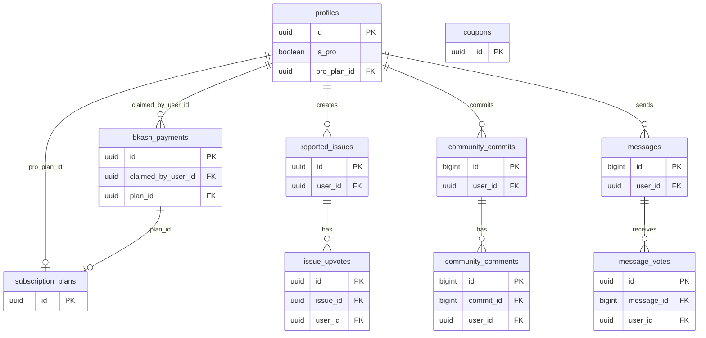

# 🔧 SocialSentry — Backend Documentation (Sync Reference)

> **Supabase Project ID**: `eckumaylnjynriffyzos`  
> **Supabase URL**: `https://eckumaylnjynriffyzos.supabase.co`  
> **Backend Stack**: Supabase (Postgres + Auth + Realtime + Edge Functions) + BkashServer Android App + Admin Dashboard (Vanilla JS)  
> **Last Updated**: April 4, 2026  


---

## 📑 Table of Contents

1. [Ecosystem Architecture Overview](#ecosystem-architecture-overview)
2. [Supabase Database Schema](#supabase-database-schema)
   - [profiles](#1-profiles-table)
   - [subscription_plans](#2-subscription_plans-table)
   - [bkash_payments](#3-bkash_payments-table)
   - [coupons](#4-coupons-table)
   - [app_config](#5-app_config-table)
   - [reported_issues, issue_device_data, issue_upvotes](#6-reported_issues-issue_device_data-issue_upvotes-bug-tracking)
   - [community_commits, community_upvotes, community_comments](#7-community_commits-community_upvotes-community_comments)
   - [messages, message_votes](#8-messages-and-message_votes-global-chat)
   - [Structural Support Tables](#9-structural-support-tables)
3. [Table Relationships (ERD)](#table-relationships-erd)
4. [Row Level Security (RLS) Policies](#row-level-security-rls-policies)
5. [Database Functions (RPCs)](#database-functions-rpcs)
6. [Supabase Edge Functions](#supabase-edge-functions)
   - [verify-payment](#1-verify-payment-edge-function)
   - [upload-bkash-payment](#2-upload-bkash-payment-edge-function)
   - [redeem-coupon](#3-redeem-coupon-edge-function)
   - [check-subscription-status](#4-check-subscription-status-edge-function)
7. [Supabase Auth Configuration](#supabase-auth-configuration)
8. [Supabase Realtime Subscriptions](#supabase-realtime-subscriptions)
9. [BkashServer App (Payment Node)](#bkashserver-app-payment-node)
10. [SocialSentry Android App ↔ Backend](#10-socialsentry-android-app--backend)
11. [Backend Performance & Impact Assessment](#11-backend-performance--impact-assessment)
12. [Admin Dashboard Backend Logic](#admin-dashboard-backend-logic)
13. [End-to-End Payment Flow](#end-to-end-payment-flow)
14. [Security Architecture](#security-architecture)
15. [Environment Variables Reference](#environment-variables-reference)

---

## Ecosystem Architecture Overview

The SocialSentry backend operates across **four integrated systems** that talk to a shared Supabase Postgres database:

```
┌────────────────────────────────────────────────────────────────────────────────────────┐
│                              SUPABASE PLATFORM                                          │
│                                                                                        │
│  ┌─────────────────┐   ┌──────────────────────────────┐   ┌──────────────────────────┐│
│  │  Postgres DB    │   │      Edge Functions (Deno)   │   │     Supabase Auth        ││
│  │  (PostgREST)    │◄──│  verify-payment              │   │  - Google OAuth           ││
│  │                 │   │  upload-bkash-payment        │   │  - OTP Phone Verify       ││
│  │  profiles       │   │  redeem-coupon               │   │  - JWT Tokens             ││
│  │  bkash_payments │   │  check-subscription-status   │   └──────────────────────────┘│
│  │  subscription_  │   └──────────────────────────────┘                               │
│  │  plans          │                                                                  │
│  │  coupons        │   ┌──────────────────────────────┐                               │
│  │  app_config     │   │  Realtime                    │                               │
│  │  issues         │   │  - issues table subscribe    │                               │
│  └─────────────────┘   └──────────────────────────────┘                               │
└────────────────────────────────────────────────────────────────────────────────────────┘
          ▲                         ▲                              ▲
          │                         │                              │
          │ anon key (PostgREST)     │ anon key + APP_SECRET        │ service_role key
          │                         │                              │
  ┌───────────────┐      ┌─────────────────────┐        ┌─────────────────────┐
  │ SocialSentry  │      │   BkashServer App   │        │   Admin Dashboard   │
  │ Android App   │      │   (Admin's Phone)   │        │   (Web Browser)     │
  │ (User Device) │      │   SMS Parser →      │        │   dashboard/        │
  │               │      │   upload-bkash-     │        │   index.html +      │
  │ - Google Auth │      │   payment function  │        │   app.js            │
  │ - Pay via SMS │      └─────────────────────┘        └─────────────────────┘
  │ - Enter TrxID │
  └───────────────┘
```

### The 4 Actors in the Ecosystem

| Actor | Auth Method | Supabase Access Level | Primary Role |
|---|---|---|---|
| **SocialSentry App** (Android) | Supabase Google OAuth + `anon` key | `anon` (PostgREST + RLS-filtered reads) | User portal: pay, verify TrxID, fetch plans |
| **BkashServer App** (Admin's Android) | Custom `APP_SECRET` header + `anon` key | Edge Function only (`upload-bkash-payment`) | Parse SMS, insert raw payments |
| **Admin Dashboard** (Browser) | `service_role` key (from `.env` or localStorage) | Full unrestricted DB access | Monitor payments, manage subscriptions, create coupons |
| **Edge Functions** (Deno runtime) | `service_role` key (Deno env secret) | Full unrestricted DB access | Business logic: validate & grant PRO, coupon redemption |

---

## Supabase Database Schema

### 1. `profiles` Table

**Purpose**: Stores one row per authenticated user (auto-created on Supabase Auth sign-up). Central user data node.

```sql
CREATE TABLE profiles (
    id               UUID        PRIMARY KEY,  -- matches auth.users.id (foreign key)
    email            TEXT,                     -- Google account email
    username         TEXT        CHECK (char_length(username) >= 3), -- display name
    full_name        TEXT,                     -- user's full name
    is_pro           BOOLEAN     DEFAULT FALSE,
    pro_expires_at   TIMESTAMPTZ,              -- NULL = lifetime
    pro_plan_id      UUID        REFERENCES subscription_plans(id),
    rank             TEXT        DEFAULT 'Clown', -- badge name e.g. "Clown"
    role             TEXT        DEFAULT 'member', -- 'member' or 'admin'
    is_verified      BOOLEAN     DEFAULT FALSE,
    is_human_verified BOOLEAN    DEFAULT FALSE,
    phone_number     TEXT,                     -- verified phone number from OTP
    username_last_changed TIMESTAMPTZ,         -- tracks when username was last modified
    ranking_start_timestamp BIGINT,            -- Unix ms when streak started
    max_ranking_level INTEGER    DEFAULT 0,    -- Max ranking level achieved
    avatar_url       TEXT,                     -- Google profile picture
    device_id        TEXT,                     -- The device ID bound to the active PRO subscription
    created_at       TIMESTAMPTZ DEFAULT now(),
    updated_at       TIMESTAMPTZ
);
```

**Key columns:**
| Column | Role in App Logic |
|---|---|
| `is_pro` | **The main PRO gate.** App reads this to unlock PRO features on login/sync. |
| `pro_expires_at` | If set, PRO expires at this time. If NULL and `is_pro=true` → Lifetime plan. |
| `pro_plan_id` | Links to the `subscription_plans` row for the user's current plan. |
| `device_id` | Hardware ID of the single allowed mobile device running the PRO version. Cleared upon subscription granting/revocation. |
| `rank` | Synced by `authRepository.updateRank()` whenever the badge changes (RankingManager). |
| `role` | Used to grant admin privileges (e.g. `mkshaon202@gmail.com` as 'admin') for moderation tools. |
| `is_human_verified` | (Legacy) Previously required to access Profile, Usage, and Ranking screens. Now bypassed by default in the app for authenticated users. | 

---

### 2. `subscription_plans` Table

**Purpose**: Master list of purchasable plans. This table drives pricing **in real-time** in the Android app — no hardcoding.

```sql
CREATE TABLE subscription_plans (
    id            UUID        PRIMARY KEY DEFAULT gen_random_uuid(),
    name          TEXT        NOT NULL,          -- "1 Month", "3 Months", "Lifetime"
    duration_days INTEGER     NOT NULL,          -- 30, 90, 180, 365, 36500 (lifetime)
    price         INTEGER     NOT NULL,          -- Price in BDT (Bangladeshi Taka)
    is_popular    BOOLEAN     DEFAULT FALSE,     -- Shows "POPULAR" badge in UI
    is_active     BOOLEAN     DEFAULT TRUE,      -- Hide from app if FALSE
    sort_order    INTEGER     DEFAULT 0,         -- Display ordering
    created_at    TIMESTAMPTZ DEFAULT now()
);
```

**Seeded Default Plans:**
| Plan | Duration | Price (৳) |
|---|---|---|
| 1 Month | 30 days | ৳149 |
| 3 Months | 90 days | ৳349 |
| 6 Months | 180 days | ৳549 (POPULAR) |
| 12 Months | 365 days | ৳999 |
| Lifetime | 36500 days | ৳2999 |

> **Note**: Prices in this table are **the single source of truth**. The Admin Dashboard and the `verify-payment` Edge Function both read from here. Change the price here and it reflects immediately in the app.

---

### 3. `bkash_payments` Table

**Purpose**: Stores every bKash SMS payment intercepted by the BkashServer. Acts as the payment ledger.

```sql
CREATE TABLE bkash_payments (
    id                 UUID        PRIMARY KEY DEFAULT gen_random_uuid(),
    trx_id             TEXT        NOT NULL UNIQUE,  -- bKash Transaction ID (UPPERCASE)
    amount             NUMERIC     NOT NULL,          -- Amount received in TK
    fee                NUMERIC     DEFAULT 0,
    balance_after      NUMERIC     DEFAULT 0,
    sender_number      TEXT,                         -- Sender's phone number from SMS
    status             TEXT        DEFAULT 'received' CHECK (status IN ('received', 'verified', 'used', 'rejected', 'refunded')),
    claimed_by_user_id UUID        REFERENCES profiles(id),  -- Who verified this payment
    plan_id            UUID        REFERENCES subscription_plans(id), -- Which plan was purchased
    coupon_code        TEXT,                         -- Coupon applied (if any)
    notes              TEXT,                         -- Admin notes
    raw_sms_text       TEXT,                         -- Raw SMS string
    received_at        TIMESTAMPTZ,                  -- SMS original receive time
    claimed_at         TIMESTAMPTZ,                  -- When status changed to 'used'
    created_at         TIMESTAMPTZ DEFAULT now()
);
```

**Status Lifecycle:**
```
SMS Received by BkashServer
         │
         ▼
   status = 'received'  ──────────────────────────► status = 'rejected'
         │                                           (Admin manually rejects)
         │ User submits TrxID → verify-payment
         ▼
   status = 'used'
   claimed_by_user_id = <user_id>
   plan_id = <plan_id>
```

**Key business rule**: `trx_id` has a `UNIQUE` constraint → **prevents double-claiming**. The `verify-payment` function checks `status === 'used'` BEFORE updating.

---

### 4. `coupons` Table

**Purpose**: Discount codes that reduce the price or activate PRO for free.

```sql
CREATE TABLE coupons (
    id               UUID        PRIMARY KEY DEFAULT gen_random_uuid(),
    code             TEXT        NOT NULL UNIQUE,  -- Uppercase coupon code
    description      TEXT,                         -- Coupon description
    discount_percent INTEGER     DEFAULT 0,        -- 0-100 (100 = free)
    discount_amount  NUMERIC     DEFAULT 0,        -- Fixed TK discount (applied AFTER %)
    max_uses         INTEGER     DEFAULT 1,         -- Total allowed claims
    current_uses     INTEGER     DEFAULT 0,         -- How many have claimed
    is_active        BOOLEAN     DEFAULT TRUE,
    expires_at       TIMESTAMPTZ,                  -- Optional expiry date
    used_by_user_ids JSONB       DEFAULT '[]',     -- JSON array of user IDs that used it
    created_at       TIMESTAMPTZ DEFAULT now()
);
```

**Coupon Logic Matrix:**
| `discount_percent` | `discount_amount` | `plan_type` | Behavior |
|---|---|---|---|
| `100` | `0` | **Instant Free PRO** — activates directly without TrxID if logic allows |
| `50` | `0` | **50% off** — user still pays reduced price + TrxID required |
| `0` | `50` | **Flat ৳50 off** — user still pays (price - 50) + TrxID required |

> **IMPORTANT**: The `plan_type` logic was refactored out of the database column and handled by Edge Function logic depending on active active campaigns.

---

### 5. `app_config` Table

**Purpose**: Key-value runtime configuration store. Used to deliver dynamic settings to the Android app without an app update.

```sql
CREATE TABLE app_config (
    id                      INTEGER PRIMARY KEY DEFAULT 1 CHECK (id = 1),
    bkash_number            TEXT,
    bkash_account_type      TEXT DEFAULT 'merchant',
    payment_instructions_bn TEXT,
    payment_instructions_en TEXT,
    is_payment_active       BOOLEAN DEFAULT TRUE,
    announcement            TEXT,
    updated_at              TIMESTAMPTZ DEFAULT now()
);
```

> **Note**: This is a single-row configuration table enforced by the `CHECK (id = 1)` constraint. Values like `bkash_number` check whether payments are active.

**Stored values:**
| Key | Example Value | Used By |
|---|---|---|
| `bkash_number` | `01XXXXXXXXXX` | Android app (payment instructions screen), Dashboard (Config tab) |
| `payment_method` | `"Make Payment"` | Android payment screen instructions |

---

### 6. `reported_issues`, `issue_device_data`, `issue_upvotes` (Bug Tracking)

**Purpose**: The in-app community portal for bug reporting and feature requests.

```sql
CREATE TABLE reported_issues (
    id          UUID        PRIMARY KEY DEFAULT gen_random_uuid(),
    user_id     UUID        REFERENCES profiles(id) DEFAULT auth.uid(),
    title       TEXT        NOT NULL,
    description TEXT,
    category    TEXT        DEFAULT 'bug', -- 'bug' | 'feature' | etc.
    status      TEXT        DEFAULT 'pending',
    is_anonymous BOOLEAN    DEFAULT FALSE,
    upvote_count INTEGER    DEFAULT 0,
    screenshot_url TEXT,
    solution_text TEXT,
    ai_category TEXT,       -- Categorized by Groq/Gemini
    ai_auto_reply TEXT,
    ai_similarity_score FLOAT8,
    matched_issue_id UUID REFERENCES reported_issues(id),
    created_at  TIMESTAMPTZ DEFAULT now(),
    updated_at  TIMESTAMPTZ DEFAULT now(),
    solved_at   TIMESTAMPTZ
);

CREATE TABLE issue_device_data (
    id          UUID        PRIMARY KEY DEFAULT gen_random_uuid(),
    issue_id    UUID        REFERENCES reported_issues(id),
    phone_model TEXT,
    android_version TEXT,
    app_version TEXT,
    permissions_granted JSONB,
    install_duration_days INTEGER,
    feature_usage_percent INTEGER,
    screens_visited JSONB,
    feature_toggles JSONB,
    community_actions JSONB,
    session_time_seconds INTEGER,
    created_at  TIMESTAMPTZ DEFAULT now()
);

CREATE TABLE issue_upvotes (
    id          UUID        PRIMARY KEY DEFAULT gen_random_uuid(),
    issue_id    UUID        REFERENCES reported_issues(id),
    user_id     UUID        REFERENCES profiles(id),
    created_at  TIMESTAMPTZ DEFAULT now()
);
```

---

### 7. `community_commits`, `community_upvotes`, `community_comments`

**Purpose**: Stores Prime Mode commitments and drives the interactive feed.

```sql
CREATE TABLE community_commits (
    id               BIGINT      PRIMARY KEY GENERATED BY DEFAULT AS IDENTITY,
    user_id          UUID        REFERENCES auth.users(id),
    username         TEXT        NOT NULL,
    avatar_url       TEXT,
    rank             TEXT        NOT NULL,
    role             TEXT        DEFAULT 'member',
    strike_time      TEXT,
    is_verified      BOOLEAN     DEFAULT FALSE,
    goal             TEXT,
    duration_hours   INTEGER,
    blocked_features TEXT,
    title            TEXT,
    date_string      TEXT,
    is_pinned        BOOLEAN     DEFAULT FALSE,
    upvote_count     INTEGER     DEFAULT 0,
    comment_count    INTEGER     DEFAULT 0,
    created_at       TIMESTAMPTZ DEFAULT now()
);

CREATE TABLE community_upvotes (
    id          UUID        PRIMARY KEY DEFAULT gen_random_uuid(),
    commit_id   BIGINT      REFERENCES community_commits(id),
    user_id     UUID        REFERENCES auth.users(id),
    created_at  TIMESTAMPTZ DEFAULT now()
);

CREATE TABLE community_comments (
    id          BIGINT      PRIMARY KEY GENERATED BY DEFAULT AS IDENTITY,
    commit_id   BIGINT      REFERENCES community_commits(id),
    user_id     UUID        REFERENCES auth.users(id),
    content     TEXT        NOT NULL,
    created_at  TIMESTAMPTZ DEFAULT now()
);

CREATE TABLE community_hidden_commits (
    id          BIGINT      PRIMARY KEY GENERATED BY DEFAULT AS IDENTITY,
    user_id     UUID        REFERENCES auth.users(id),
    commit_id   BIGINT      REFERENCES community_commits(id),
    created_at  TIMESTAMPTZ DEFAULT now()
);
```

**Key Logic**:
- `duration_hours` is converted to "X days".
- **Anonymous commits**: Sets `username = "Anonymous Sentry"`.
- Uses Supabase Postgres functions or client-side transactions to sync `upvote_count` and `comment_count`.

---

### 8. `messages` and `message_votes` (Global Chat)

**Purpose**: Live global community chat with threading.
> **Note**: Chat voting (upvotes/downvotes) has been deprecated in the app UI to simplify the chat interface, but the underlying columns (`upvote_count`, `downvote_count`) and `message_votes` table remain in the schema for historical compatibility.

```sql
CREATE TABLE messages (
    id                BIGINT      PRIMARY KEY GENERATED BY DEFAULT AS IDENTITY,
    created_at        TIMESTAMPTZ DEFAULT timezone('utc'::text, now()),
    content           TEXT        NOT NULL,
    user_id           UUID        REFERENCES profiles(id),
    username          TEXT,
    full_name         TEXT,
    avatar_url        TEXT,
    rank              TEXT,
    role              TEXT        DEFAULT 'member',
    strike_time       TEXT,
    is_pinned         BOOLEAN     DEFAULT FALSE,
    is_verified       BOOLEAN     DEFAULT FALSE,
    reply_to_id       BIGINT,
    reply_to_username TEXT,
    reply_to_content  TEXT,
    upvote_count      INTEGER     DEFAULT 0,
    downvote_count    INTEGER     DEFAULT 0
);

CREATE TABLE message_votes (
    id          UUID        PRIMARY KEY DEFAULT gen_random_uuid(),
    message_id  BIGINT      REFERENCES messages(id),
    user_id     UUID        REFERENCES auth.users(id),
    vote_type   SMALLINT,   -- 1 for upvote, -1 for downvote
    created_at  TIMESTAMPTZ DEFAULT timezone('utc'::text, now())
);
```

---

### 9. Structural Support Tables

| Table | Purpose |
|---|---|
| `home_page_notifications` | Pushes announcements (`title`, `content`, `type`, `link`) directly to the app home screen. |
| `blocked_users` | `blocker_id` and `blocked_id`. Hides messages/commits from specific abusive users locally in the app. |
| `community_hidden_commits` | Used for user-level moderation to hide individual community posts from a specific user's feed. |

---

## Table Relationships (ERD)



---

## Row Level Security (RLS) Policies

All tables have RLS enabled. Here's the complete policy matrix:

| Table | Operation | Policy | Who Can |
|---|---|---|---|
| `subscription_plans` | SELECT | `Plans are public` | Anyone (anon users) — `USING (true)` |
| `subscription_plans` | INSERT/UPDATE/DELETE | None defined | Only `service_role` / Admin Dashboard |
| `coupons` | SELECT | `Coupons readable` | Anyone — `USING (true)` |
| `coupons` | INSERT/UPDATE/DELETE | None | Only Edge Functions (`service_role`) |
| `bkash_payments` | SELECT | `Users see own payments` | Users can only read rows where `used_by = auth.uid()` |
| `bkash_payments` | INSERT | None (blocked by RLS) | Only `service_role` (BkashServer via Edge Function) |
| `app_config` | SELECT | `Config is public` | Anyone — `USING (true)` |
| `profiles` | SELECT | Default Supabase policy | Users can only see their own profile |
| `profiles` | UPDATE | Default Supabase policy | Users can update their own profile (guarded by Edge Functions for `is_pro`) |

> **Critical**: Since `bkash_payments` has no INSERT RLS policy for regular users, only the `upload-bkash-payment` Edge Function (running as `service_role`) can insert new payment records. Regular app users can **never** directly insert a payment — they can only submit their TrxID to `verify-payment`.

---

## Database Functions (RPCs)

### `increment_coupon_usage(p_code TEXT)`

```sql
CREATE OR REPLACE FUNCTION increment_coupon_usage(p_code TEXT)
RETURNS VOID AS $$
BEGIN
    UPDATE coupons
    SET current_uses = current_uses + 1
    WHERE code = p_code;
END;
$$ LANGUAGE plpgsql SECURITY DEFINER;
```

**Called by**: Both `verify-payment` and `redeem-coupon` Edge Functions after a coupon is successfully applied.  
**Security**: `SECURITY DEFINER` — executes as the function owner, bypassing RLS.

---

## Supabase Edge Functions

All Edge Functions live in `/supabase/functions/` and are deployed to the Supabase Deno runtime. They use `service_role` key internally (stored as a Deno secret, never exposed to clients).

### 1. `verify-payment` Edge Function

**File**: `supabase/functions/verify-payment/index.ts`  
**Auth**: `verify_jwt: false` — The function validates user identity via `user_id` in the JSON body (not JWT). This allows calls from the Android app without a Bearer token.  
**Called by**: SocialSentry Android app (`PaymentRepository`) when user submits TrxID.

#### Request Format
```json
POST https://eckumaylnjynriffyzos.supabase.co/functions/v1/verify-payment
Content-Type: application/json

{
  "user_id": "uuid-of-authenticated-user",
  "plan_id": "uuid-of-selected-plan",
  "trx_id": "ABC123XYZ",
  "coupon_code": "SAVE50"  // optional
}
```

#### Complete Logic Flow

```
Request arrives
    │
    ├─ 1. Validate: user_id + plan_id required → 400 if missing
    │
    ├─ 2. Verify user exists in profiles → 404 if not found
    │
    ├─ 3. Fetch plan from subscription_plans (must be is_active=true) → 404 if not found
    │
    ├─ 4. If coupon_code provided:
    │      ├─ Fetch coupon (must be is_active=true, case-insensitive match)
    │      ├─ Check expiry → 400 if expired
    │      ├─ Check usage limit (current_uses >= max_uses) → 400 if exceeded
    │      └─ Extract discount_percent + discount_amount
    │
    ├─ 5. Calculate expected_price:
    │      expected = plan.price
    │      if discount_percent > 0 && < 100: expected = round(expected * (1 - discount_percent/100))
    │      if discount_amount > 0: expected = max(0, expected - discount_amount)
    │      if expected <= 0: isFreeWithCoupon = true
    │
    ├─ 6A. FREE COUPON PATH (isFreeWithCoupon = true):
    │      ├─ increment_coupon_usage(coupon_code)
    │      ├─ grantPro(user_id, plan_id, expiresAt)
    │      └─ Return 200 success
    │
    └─ 6B. PAID PATH (TrxID required):
           ├─ Validate trx_id not empty → 400 if missing
           ├─ Lookup bkash_payments by trx_id (UPPERCASE match)
           │    → 404 if not found
           ├─ Check payment.status:
           │    → 409 if 'used' (TrxID already claimed)
           │    → 400 if 'rejected'
           ├─ Amount tolerance check:
           │    |payment.amount - expected_price| > 5 TK → 400 mismatch
           ├─ Atomic PRO grant:
           │    UPDATE bkash_payments SET status='used', claimed_by_user_id=user_id, plan_id=plan_id
           │    increment_coupon_usage (if coupon present)
           │    grantPro(user_id, plan_id, expiresAt)
           └─ Return 200 success with plan details
```

#### `grantPro()` Helper Logic

This function handles **subscription stacking** — if a user already has active PRO, it extends rather than resets:
- Active PRO (+ plan matches): Adds `duration_days` to existing `pro_expires_at`.
- Expired PRO or new plan: Starts calculated from `NOW()`.

> **Note**: As of March 2026, granting a subscription now explicitly clears `device_id = null` in the `profiles` table. This allows the user to re-bind a completely fresh device on their next `check-subscription-status` call without getting blocked from an old subscription.
await supabase.from("profiles").update({
    is_pro: true,
    pro_expires_at: finalExpiry,  // stacked or fresh
    pro_plan_id: planId,
}).eq("id", userId);
```

#### Response Formats
```json
// Success (200)
{
  "success": true,
  "message": "Payment verified! PRO activated.",
  "pro_expires_at": "2026-09-22T00:00:00Z",
  "amount_paid": 349,
  "plan_name": "3 Months",
  "duration_days": 90
}

// Error (400/404/409)
{
  "success": false,
  "error": "This TrxID has already been used."
}
```

---

### 2. `upload-bkash-payment` Edge Function

**File**: `supabase/functions/upload-bkash-payment/index.ts`  
**Auth**: Custom `x-app-secret` header (not JWT) — prevents unauthorized payment uploads.  
**Called by**: BkashServer Android app on the admin's phone.

#### Request Format
```json
POST https://eckumaylnjynriffyzos.supabase.co/functions/v1/upload-bkash-payment
Content-Type: application/json
x-app-secret: <BKASH_APP_SECRET>
apikey: <SUPABASE_ANON_KEY>

{
  "trx_id": "ABC123XYZ",
  "amount": 349,
  "sender_number": "017XXXXXXXX",
  "status": "received"
}
```

#### Logic Flow
```
Request arrives
    │
    ├─ 1. Check x-app-secret header matches BKASH_APP_SECRET env var
    │      → 401 Unauthorized if mismatch
    │
    ├─ 2. Parse JSON body as paymentData
    │
    ├─ 3. INSERT paymentData into bkash_payments using service_role client
    │      (bypasses all RLS — only this function can insert payments)
    │
    └─ 4. Return inserted row or error
```

**Security Design**: The `BKASH_APP_SECRET` never appears in any app APK. It lives only as:
- A Deno Edge Function secret (Supabase dashboard)
- A hardcoded constant in the BkashServer Android app (`local.properties` or build config)

---

### 3. `redeem-coupon` Edge Function

**File**: `supabase/functions/redeem-coupon/index.ts`  
**Auth**: JWT required — reads `Authorization: Bearer <jwt>` header to identify user.  
**Called by**: SocialSentry Android app during coupon code entry on the subscription screen.

#### Request Format
```json
POST https://eckumaylnjynriffyzos.supabase.co/functions/v1/redeem-coupon
Authorization: Bearer <user-jwt>
Content-Type: application/json

{
  "coupon_code": "FREE100"
}
```

#### Logic Flow
```
Request arrives
    │
    ├─ 1. Verify JWT → get authenticated user (throws if no auth header)
    │
    ├─ 2. Normalize coupon_code to UPPERCASE
    │
    ├─ 3. Fetch coupon from coupons table
    │      → Return failure if not found
    │
    ├─ 4. Validate coupon:
    │      ├─ is_active must be TRUE
    │      ├─ expires_at not in past
    │      └─ current_uses < max_uses
    │
    ├─ 5. Check if user already used this coupon
    │      (coupon.used_by_user_ids contains user.id)
    │      → Return failure if already used
    │
    ├─ 6A. AUTO-ACTIVATE PATH (discount_percent >= 100 AND plan_type != 'all'):
    │      ├─ Calculate duration_days from plan_type string
    │      ├─ Update coupons: current_uses++, push user.id to used_by_user_ids
    │      ├─ INSERT into subscriptions table (legacy/alternative table)
    │      ├─ UPDATE profiles: is_pro=true, pro_expires_at, active_subscription_id
    │      └─ Return { success: true, is_activated: true }
    │
    └─ 6B. DISCOUNT-ONLY PATH (partial discount or plan_type='all'):
           → Return { success: true, is_activated: false, discount_percent, discount_amount }
              (Android app uses this metadata to reduce price in verify-payment call)
```

> **Note**: `redeem-coupon` is the *read/validate* function. The actual PRO grant for partial discount coupons happens in `verify-payment`. Only 100%-free specific-plan coupons are auto-activated here.

---

### 4. `check-subscription-status` Edge Function

**File**: `supabase/functions/check-subscription-status/index.ts`  
**Auth**: JWT required (`verify_jwt: true`).  
**Called by**: SocialSentry Android app at login/startup to verify PRO status sync.
**Current Version**: v3 (deployed March 23 2026)

#### Request Format
```json
GET https://eckumaylnjynriffyzos.supabase.co/functions/v1/check-subscription-status
Authorization: Bearer <user-jwt>
```

#### Logic Flow + Response Matrix

```
Request arrives → validate JWT (via service_role client + auth.getUser())
    │
    ├─ Missing Authorization header → throw → check_failed: true
    │
    ├─ Admin bypass (mkshaon224@gmail.com | mkshaon2024@gmail.com)
    │   → { is_pro: true, plan: "admin_bypass", expires_at: null }
    │
    ├─ Fetch profiles row for user.id
    │   ├─ Profile not found / DB error → { is_pro: false, error: 'profile_not_found', check_failed: true }
    │   ├─ Device mismatch → { is_pro: false, error: 'Device limit reached', is_device_blocked: true }
    │   ├─ is_pro = false → { is_pro: false }
    │   ├─ is_pro = true AND pro_expires_at = NULL → { is_pro: true, plan: "lifetime", expires_at: null }
    │   ├─ is_pro = true AND pro_expires_at > NOW()
    │   │   → { is_pro: true, plan: <pro_plan_id>, expires_at: "...", days_remaining: N }
    │   └─ is_pro = true BUT pro_expires_at <= NOW() (EXPIRED)
    │       → UPDATE profiles SET is_pro=false, pro_plan_id=null, pro_expires_at=null, device_id=null
    │       → { is_pro: false, expired: true }
    │
    └─ Any uncaught exception → { is_pro: false, error: msg, check_failed: true }
```

#### Critical Error Handling (March 2026 Fix)

> **Bug Fixed**: Previously, any server-side error (auth failures, network issues) returned `{ is_pro: false }`, which caused the Android app to incorrectly show "Subscription Expired" notifications for active Pro users on login.

**Fix**: All error paths now return `check_failed: true`. The Android app's `CheckSubscriptionResponse` checks this flag:
- If `check_failed == true` → skip updating local Pro status, preserve existing status
- If `expired == true` → server explicitly confirmed expiry → show "expired" notification
- `is_pro: false` alone (without `expired: true`) is **not** enough to show an expired notification

**Android model** (`SubscriptionModels.kt: CheckSubscriptionResponse`):
```kotlin
@Serializable
data class CheckSubscriptionResponse(
    val is_pro: Boolean,
    val plan: String? = null,
    val expires_at: String? = null,
    val days_remaining: Int? = null,
    val expired: Boolean? = null,
    val error: String? = null,
    val check_failed: Boolean? = null  // ← Key fix: true = server error, NOT expiry
)
```

**Key feature**: This function **auto-revokes** expired subscriptions by clearing `profiles.is_pro`, `profiles.pro_plan_id`, and `profiles.pro_expires_at` atomically when expiry is detected.

---

## Supabase Auth Configuration

### Providers Enabled
| Provider | Used For | Details |
|---|---|---|
| **Google OAuth** | Main user authentication | Sign-in with Google account. Returns `email`, `avatar_url`, `user_id` |
| **Phone (OTP)** | Human verification gate | User enters phone number → SMS OTP → `is_human_verified = true` in profiles |

### Auth Flow in Android App

```
App Launch
    │
    ├─ supabase.auth.currentSession() → if session exists, restore user
    │
    ├─ No session → show auth screen
    │     └─ Google Sign-In button → signInWith(Google) → OAuth redirect
    │
    └─ After sign-in:
          ├─ Supabase creates/updates auth.users row
          └─ AuthRepository:
               ├─ Fetch profiles row matching user.id
               ├─ If no profile → insert new profile (email, username)
               └─ **Optimistic Sync**: Immediately apply `is_pro` and `pro_expires_at` from profile to local DataStore (bypasses Edge Function cold-starts)
```

### JWT Token Handling
- **Anon Key**: Used in all Android app PostgREST calls (env var `SUPABASE_ANON_KEY`)
- **User JWT**: Generated by Supabase Auth after login — used in requests requiring RLS identity (`check-subscription-status`, `redeem-coupon`)
- **Service Role Key**: Used by Edge Functions internally + Admin Dashboard — **NEVER put in Android APK**

---

## Supabase Realtime

## Supabase Realtime Subscriptions

The app maintains active WebSocket connections to Supabase Realtime for live UI updates across 4 primary channels.

### Active Channels & Triggers

| Channel | Triggering Event | Observed By | Result in App |
|---|---|---|---|
| `issue-updates` | `UPDATE` on `reported_issues` | `NotificationRepository` (Startup) | Pushes a local notification: "Your issue [TITLE] is now [STATUS]" |
| `messages` | `INSERT`, `UPDATE`, `DELETE` on `messages` | `CommunityViewModel` (Global Chat) | Instantly appends new messages, updates vote counts/pins, or removes deleted rows from the Chat feed. |
| `community_commits` | `INSERT`, `UPDATE` on `community_commits` | `CommunityViewModel` (Feed) | Live-updates the Prime Mode community feed with fresh commits and their upvote/comment counts. |
| `community_comments`| `INSERT` on `community_comments` | `CommunityViewModel` (Comments) | Real-time insertion of replies into active comment threads. |

### Client-Side Implementation Example
```kotlin
// The app uses Supabase Kotlin GoTrue & Realtime SDKs
val messageChannel = supabaseClient.channel("messages")

messageChannel.postgresChangeFlow<PostgresAction.Insert>("public", "messages")
    .onEach { action ->
        val newMessage = action.decodeRecord<Message>()
        // Prepend to local StateFlow feed
    }
    .launchIn(viewModelScope)
```

---

## BkashServer App (Payment Node)

### Purpose
Private Android app deployed on the **admin's personal phone**. Its sole job is to intercept bKash payment confirmation SMS messages, parse the transaction data, and automatically upload them to Supabase.

### Architecture

```
Admin's Phone
    └─ BkashServer App
          ├─ SMS BroadcastReceiver (listens for incoming SMS)
          │     ├─ Filter: sender = "bKash" / "01779-054249" (bKash official number)
          │     └─ Match regex: "TrxID [A-Z0-9]+", "Tk [0-9]+"
          │
          ├─ SMS Parser
          │     ├─ Extract: trx_id (uppercase), amount (integer), sender_number
          │     └─ Build payment JSON payload
          │
          └─ HTTP Client (Ktor or OkHttp)
                └─ POST to upload-bkash-payment Edge Function
                      Headers: x-app-secret: <APP_SECRET>
                               apikey: <SUPABASE_ANON_KEY>
                      Body: { trx_id, amount, sender_number, status: "received" }
```

### What Gets Stored in `bkash_payments` After Upload

```json
{
  "trx_id": "ABC123XYZ",
  "amount": 349,
  "fee": 0.00,
  "balance_after": 5000.00,
  "sender_number": "01XXXXXXXXX",
  "status": "received",
  "raw_sms_text": "You have received Tk 349.00 from 01XXXXXXXXX. Fee Tk 0.00. Balance Tk 5000.00. TrxID ABC123XYZ",
  "claimed_by_user_id": null,
  "plan_id": null,
  "coupon_code": null,
  "created_at": "2026-03-22T06:00:00Z",
  "received_at": "2026-03-22T05:59:00Z"
}
```

### Security Key Points
- `APP_SECRET` is stored in BkashServer app's `local.properties` / `BuildConfig` — never in the user-facing SocialSentry APK
- The Edge Function validates this secret on every request — without it, any call is rejected with `401`
- The `service_role` key never leaves the Supabase edge function environment

---

## 10. SocialSentry Android App ↔ Backend

### Key Component/Repository Files

| Component | File | What It Does |
|---|---|---|
| `AuthRepository` | `data/repository/AuthRepository.kt` | Google login, fetch/update profile, sync PRO status, update rank + human verification |
| `PaymentRepository` | `data/repository/PaymentRepository.kt` | Fetch subscription plans, fetch bKash number from app_config, call verify-payment |
| `NotificationRepository`| `data/repository/NotificationRepository.kt` | Subscribe to `issue-updates` Realtime channel, push local notifications |
| `CommunityViewModel` | `ui/community/CommunityViewModel.kt` | Heavy lifting for Global Chat (`messages`) and Prime Mode Feed (`community_commits`). Manages 3 separate realtime channels. |
| `ReportProblemViewModel`| `ui/community/ReportProblemViewModel.kt`| CRUD for bug reports (`reported_issues`, `issue_device_data`, `issue_upvotes`). |

### PostgREST Calls Made by Android App (via `anon` key)

| Table | Operation | Trigger | Purpose |
|---|---|---|---|
| `subscription_plans` | SELECT | Paywall screen load | Load plan options ordered by `sort_order` |
| `app_config` | SELECT | Payment screen load | Get official bKash payment number |
| `profiles` | SELECT/UPDATE | Login / Profile screen | **Primary** source for Optimistic PRO sync; update rank, username |
| `reported_issues` | SELECT/INSERT | Community Portal load / Submit | Fetch bugs, insert new report with device data |
| `messages` | SELECT/INSERT/UPDATE | Global Chat / Sending msg | Load chat history, send message, pin/delete |
| `message_votes` | INSERT/UPDATE/DELETE | User taps Upvote/Downvote | Register a Reddit-style vote on a chat message |
| `community_commits` | SELECT/INSERT | Prime Mode Feed / Commit | Fetch feed, submit a new Prime Mode commitment |
| `community_comments`| SELECT/INSERT | Tapping a commit | Load threaded comments, post a new reply |

### Edge Function Calls Made by Android App

| Function | Trigger | Auth Method |
|---|---|---|
| `verify-payment` | User taps "Verify Payment" after entering TrxID | `user_id` in body (no JWT needed) |
| `redeem-coupon` | User submits a coupon code | Bearer JWT token |
| `check-subscription-status`| App startup / Background verification | Bearer JWT token | Secondary verification after Optimistic Sync |

---

## 11. Backend Performance & Impact Assessment

With the introduction of the Global Chat and interactive Community Feed, the Supabase backend experiences significantly different traffic patterns compared to the legacy passive-blocking architecture.

### 1. High-Frequency Postgres Operations (Chat & Votes)
- **The Chat Flow**: Every time a user sends a message in Global Chat, the app performs a direct `INSERT` into the `messages` table. 
- **The Voting Flow**: Upvoting/Downvoting a message requires a sequence of Postgres operations: querying existing vote state, updating/deleting `message_votes`, and relying on Postgres to calculate the aggregate `upvote_count` dynamically.
- **Impact**: This generates high write-heavy traffic natively routed through PostgREST.

### 2. Supabase Realtime Concurrency Limits
- **The Connection Load**: When a user enters the Community interface, the app establishes WebSocket connections for **2 distinct channels** simultaneously (`messages` and `community_commits`). To conserve the Supabase Free Tier 200 connection limit, `community_comments`, `user_upvotes`, and `issue-updates` subscriptions were disabled.
- **Impact & Considerations**: Supabase handles connection pooling natively. Each active app instance inherently represents 1 concurrent Realtime connection containing 2 channel subscriptions. 1,000 users opening the Community tab simultaneously would consume 1,000 WebSocket connections, capping out the 200 Free limit. By reducing the number of subscribed channels from 4 to 2, the data transmission overhead is significantly improved.

### 3. Mitigation Strategies Implemented
- **Device Data Caching**: To prevent excessive reads, static configuration data (like `app_config.bkash_number`) is fetched once and cached.
- **Optimistic UI Updates**: The `CommunityViewModel` implements optimistic state updates for chat messages and votes. When a user upvotes, the UI increments instantly before the Supabase `INSERT` confirms, masking latency and smoothing the UX without requiring immediate read-after-write blocking.
- **Background Throttling**: The Accessibility Service does not blindly spam backend syncs. Local data syncing (like blocking strings or adult checks) occurs natively on-device, isolating the backend specifically for social, billing, and configuration flows.

---

## Admin Dashboard Backend Logic

**Files**: `dashboard/index.html` + `dashboard/app.js`  
**URL**: Served locally or from any static host.  
**Auth**: Uses `service_role` key — loaded from `dashboard/.env` file or saved in browser `localStorage`.

### Dashboard Architecture

```
Browser loads index.html
    │
    ├─ Tries to load dashboard/.env file via fetch('.env')
    │     ├─ Success → parses SUPABASE_URL + SUPABASE_SERVICE_ROLE_KEY
    │     └─ Failure → loads from localStorage (if previously saved)
    │
    ├─ initSupabase(url, serviceRoleKey)
    │     └─ Creates Supabase JS client with service_role key
    │           (bypasses ALL RLS — full DB access)
    │
    └─ refreshData() → parallel calls:
          ├─ fetchOverviewStats()
          ├─ fetchRecentPayments()
          ├─ fetchAllPayments()
          ├─ fetchSubscribers()
          ├─ fetchCoupons()
          ├─ fetchAppConfig()
          └─ loadPlans()
```

### Dashboard Tabs and Their Supabase Queries

#### Overview Tab
| Metric | Query | What It Shows |
|---|---|---|
| **Total Revenue** | `bkash_payments.select('amount').eq('status','used')` → sum | Sum of all `amount` where status is `used` |
| **Active Subs** | `profiles.select('*', {count:'exact'}).eq('is_pro', true)` | Count of unique users with `is_pro = true` |
| **Pending Verify** | `bkash_payments.select('*', {count:'exact'}).eq('status','received')` | Count of unverified payments awaiting action |

#### Payments Tab
- `bkash_payments.select('*, subscription_plans(name)').order('created_at', desc).limit(20)` — full payment ledger with plan name join

#### Subscribers Tab
- `profiles.select('*, subscription_plans(name)').eq('is_pro', true).limit(12)` — grid of all active PRO users

#### Coupons Tab
- `coupons.select('*').order('created_at', desc)` — all coupon codes with usage stats

#### Config Tab
- `app_config.select('*').single()` — reads bKash number
- `app_config.update({bkash_number}).eq('id', 1)` — saves bKash number change

### Dashboard Admin CRUD Operations

| Action | Supabase Operation |
|---|---|
| **Manual PRO Activation** | Find user by email in `profiles` → get plan duration → `profiles.update({is_pro:true, pro_plan_id, pro_started_at, pro_expires_at})` |
| **Manage Subscriber** | `profiles.update({pro_plan_id, pro_expires_at})` — change plan/expiry |
| **Revoke PRO** | `profiles.update({is_pro:false, pro_plan_id:null, pro_expires_at:null})` |
| **Verify TrxID (Manual)** | `bkash_payments.update({status:'used', notes:'Manually verified'}).eq('trx_id', id)` |
| **Reject TrxID** | `bkash_payments.update({status:'rejected'}).eq('id', id)` |
| **Create Coupon** | `coupons.insert([{code, max_uses, discount_percent, discount_amount, is_active:true}])` |
| **Delete Coupon** | `coupons.delete().eq('id', id)` |
| **Update bKash Number** | `app_config.update({bkash_number}).eq('id', 1)` |

### Dashboard `.env` File Structure

```
# dashboard/.env
SUPABASE_URL=https://eckumaylnjynriffyzos.supabase.co
SUPABASE_SERVICE_ROLE_KEY=eyJ...your_service_role_key_here...
DB_PASSWORD=your_db_password_here
```

> ⚠️ This file must **never** be committed to git. It is listed in `.gitignore`.

---

## End-to-End Payment Flow

### Standard Paid Transaction

```
Step 1: ADMIN sets up
    Admin opens dashboard → Config tab → sets bKash number to "017XXXXXXXX"
    ↓
    app_config updated in Supabase

Step 2: USER sees payment instructions
    Android app opens SubscriptionScreen
    ↓
    PaymentRepository fetches:
      - subscription_plans (all active plans)
      - app_config.bkash_number ("017XXXXXXXX")
    ↓
    UI shows: "Send ৳349 to 017XXXXXXXX via bKash"

Step 3: USER pays
    User opens bKash app → sends ৳349 to 017XXXXXXXX
    ↓
    bKash sends SMS confirmation to admin's phone:
    "You received Tk 349 from 01XXXXXXXXX. TrxID ABC123XYZ."

Step 4: BKASHSERVER captures payment
    BkashServer app intercepts SMS
    ↓
    Parses: trx_id="ABC123XYZ", amount=349, sender="01XXXXXXXXX"
    ↓
    POST upload-bkash-payment (with x-app-secret header)
    ↓
    bkash_payments row inserted: { trx_id:"ABC123XYZ", amount:349, status:"received" }

Step 5: USER submits TrxID
    User enters "ABC123XYZ" in the app + selects plan
    ↓
    PaymentRepository calls verify-payment Edge Function:
    { user_id:"...", plan_id:"...", trx_id:"ABC123XYZ" }

Step 6: VERIFY-PAYMENT validates
    1. User exists ✓
    2. Plan active ✓
    3. TrxID found → status=received ✓
    4. Amount match: |349 - 349| = 0 ≤ 5 ✓
    5. Atomic update:
       bkash_payments.status = 'used'
       bkash_payments.claimed_by_user_id = user.id
       profiles.is_pro = true
       profiles.pro_expires_at = now() + 90 days
    ↓
    Returns { success: true, pro_expires_at: "2026-06-22..." }

Step 7: ANDROID APP handles success
    PaymentViewModel receives success
    ↓
    AuthRepository re-fetches profile → is_pro = true now
    ↓
    DataStoreManager syncs is_pro = true to local DataStore
    ↓
    PRO features unlocked (Chrome Reels Blocker, Website Blocker, etc.)
    ↓
    Lottie success animation plays
```

### Free Coupon Transaction

```
User enters coupon "FREE100" → selects plan
    ↓
verify-payment called with { coupon_code: "FREE100", plan_id: "...", user_id: "..." }
    ↓
Edge function: discount_percent=100 → isFreeWithCoupon=true
    ↓
Skip TrxID check entirely
    ↓
increment_coupon_usage("FREE100")
grantPro(user_id, plan_id, expiresAt)
    ↓
Return success — no bKash payment ever needed
```

---

## Security Architecture

### Key Hierarchy

```
┌─────────────────────────────────────────────────────────┐
│ MOST PRIVILEGED                                         │
│                                                         │
│  service_role key   ──→ Full DB access, bypasses RLS   │
│    - Edge Functions (Deno env secret)                   │
│    - Admin Dashboard (browser localStorage / .env file)│
│    - NEVER in Android APK                              │
│                                                         │
│  BKASH_APP_SECRET   ──→ Only validates upload-bkash-payment│
│    - Deno env secret                                    │
│    - BkashServer app BUILD_CONFIG (admin phone only)    │
│    - NEVER in user-facing SocialSentry APK             │
│                                                         │
│  anon key           ──→ Limited access via RLS          │
│    - Android app (SocialSentry APK BuildConfig)         │
│    - Android app (BkashServer to call Edge Function)    │
│                                                         │
│ LEAST PRIVILEGED                                        │
└─────────────────────────────────────────────────────────┘
```

### Attack Surface Mitigations

| Threat | Mitigation |
|---|---|
| **User reverse-engineers APK to get service_role key** | `service_role` key is NEVER injected into Android APK. App uses `anon` key only. |
| **User directly inserts fake payments into `bkash_payments`** | RLS blocks all INSERT from regular auth users. Only `upload-bkash-payment` Edge Function (authenticated by APP_SECRET) can insert. |
| **User submits same TrxID twice** | `trx_id` is `UNIQUE` in DB. Edge function checks `status = 'used'` → 409 Conflict. |
| **User claims a payment that doesn't match the amount** | ±5 TK tolerance check in `verify-payment`. Any larger mismatch returns 400. |
| **User creates fake bKash payment on admin's database** | Requires knowing `BKASH_APP_SECRET`. Brute-force mitigated by Supabase rate limits. |
| **Admin dashboard credentials exposed** | `.env` and `localStorage` are client-only. `.gitignore` prevents git commits. Dashboard only runs locally or on admin's machine. |
| **Coupon code reuse** | `used_by_user_ids[]` array tracks per-user usage. `current_uses >= max_uses` check blocks exhausted coupons. |

---

## Environment Variables Reference

### Android App (`.env` in project root → `BuildConfig`)

```properties
SUPABASE_URL="https://eckumaylnjynriffyzos.supabase.co"
SUPABASE_ANON_KEY="eyJ..."           # anon (public) key
GROQ_API_KEY="gsk_..."               # Groq API key (primary LLM for Hakari)
GEMINI_API_KEY="AIza..."             # Primary Gemini key (fallback LLM)
GEMINI_API_KEY_1="AIza..."           # Backup Gemini key #1
GEMINI_API_KEY_2="AIza..."           # Backup Gemini key #2
GEMINI_API_KEY_3="AIza..."           # Backup Gemini key #3
```

### BkashServer App (separate `.env` / build config)

```properties
SUPABASE_URL="https://eckumaylnjynriffyzos.supabase.co"
SUPABASE_ANON_KEY="eyJ..."           # anon key (to call Edge Function)
BKASH_APP_SECRET="your_secret_here"  # Matches Edge Function env var
```

### Edge Functions (Supabase Deno Secrets)

| Secret | Usage |
|---|---|
| `SUPABASE_URL` | Auto-injected by Supabase |
| `SUPABASE_SERVICE_ROLE_KEY` | Auto-injected by Supabase — gives full DB access |
| `BKASH_APP_SECRET` | Custom secret — validates BkashServer upload requests |

### Admin Dashboard (`dashboard/.env`)

```properties
SUPABASE_URL=https://eckumaylnjynriffyzos.supabase.co
SUPABASE_SERVICE_ROLE_KEY=eyJ...    # Full access key
DB_PASSWORD=your_db_password         # Direct Postgres access (optional)
```

---

## Supabase Config (`supabase/config.toml`)

```toml
[functions.upload-bkash-payment]
enabled = true
verify_jwt = true
import_map = "./functions/upload-bkash-payment/deno.json"
entrypoint = "./functions/upload-bkash-payment/index.ts"
```

> **Note**: The local `config.toml` only contains the configuration for `upload-bkash-payment`. The other functions' JWT verification configurations (e.g., `verify-payment` being `verify_jwt = false`) are currently managed directly via the Supabase Dashboard or CLI deployment flags.

---

---

## 16. Firebase Cloud Messaging (FCM) Integration

SocialSentry uses FCM for remote push notifications, complementing Supabase Realtime for delivery when the app is in the background or killed.

### Push Strategy
1. **Device Registration**: On app start, `SocialSentryMessagingService` retrieves the FCM token and syncs it with the `profiles` table (via `fcm_token` column).
2. **Notification Triggers**:
   - **Community Activity**: New replies to a user's Prime Mode commit or upvotes.
   - **Admin Announcements**: High-priority global alerts sent via Firebase Console or Admin Dashboard.
   - **Hakari Reminders**: Scheduled motivational check-ins sent if the background service detects inactivity.

### Payload Structure
```json
{
  "to": "FCM_TOKEN",
  "notification": {
    "title": "Hakari's Guidance",
    "body": "It's time for your hourly check-in, Giga Chad!"
  },
  "data": {
    "type": "hakari_checkin",
    "click_action": "OPEN_CHAT"
  }
}
```

---

## 17. Local Persistence (Room DB)

While Supabase handles global data (Auth, Pro, Community), the app utilizes **Room Database** for high-frequency, private, or complex local state that doesn't require cloud syncing (or as a primary cache).

### Key Entities:
1. **Hakari AI History**:
   - `ConversationEntity`: Metadata for chat threads (title, last updated).
   - `ChatMessageEntity`: Individual messages (content, role, timestamp) linked to a conversation via UUID.
2. **To-Do System**:
   - `TaskEntity`: Stores tasks, priority, and `isRoutine` flag.
   - `RoutineResetWorker`: Daily background job that copies all tasks marked `isRoutine` from the previous day to the current day at `00:01`.
3. **Force Mode Logs**:
   - `ForceModeSessionEntity`: Records granular focus session start/end times and subjects for the "Today's Total" calculation.

---

*Backend Documentation last updated: April 4, 2026 — Covers: Supabase DB Schema (incl. `community_commits`), 4 Edge Functions, FCM Push, and Room DB Persistence.*

